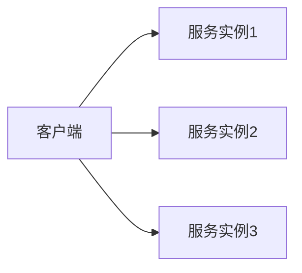
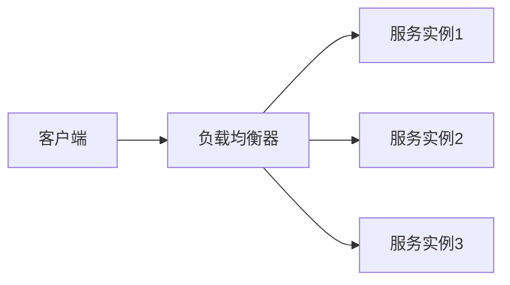

# 负载均衡策略指南

## 概述

负载均衡是分布式系统中的核心组件，它通过将请求分发到多个服务实例来提高系统的可用性、扩展性和性能。正确的负载均衡策略可以显著提升系统吞吐量和可靠性。

## 核心负载均衡类型

### 1. 客户端负载均衡
**客户端维护服务实例列表并自行选择**



### 2. 服务端负载均衡
**通过独立的负载均衡器分发请求**



## 常用负载均衡算法

### 1. 轮询 (Round Robin)
**依次将请求分发到每个服务器**

```java
public class RoundRobinLoadBalancer {
    private final List<ServiceInstance> instances;
    private int currentIndex = 0;
    
    public ServiceInstance chooseInstance() {
        if (instances.isEmpty()) {
            throw new IllegalStateException("No instances available");
        }
        
        ServiceInstance instance = instances.get(currentIndex);
        currentIndex = (currentIndex + 1) % instances.size();
        return instance;
    }
}
```

**特点：**
- 简单公平
- 适合服务器性能相近的场景
- 可能忽略服务器当前负载

### 2. 加权轮询 (Weighted Round Robin)
**根据服务器权重进行分发**

```java
public class WeightedRoundRobinLoadBalancer {
    private final List<ServiceInstance> instances;
    private final int[] weights;
    private int currentIndex = -1;
    private int currentWeight = 0;
    private int maxWeight;
    private int gcdWeight;
    
    public ServiceInstance chooseInstance() {
        while (true) {
            currentIndex = (currentIndex + 1) % instances.size();
            if (currentIndex == 0) {
                currentWeight = currentWeight - gcdWeight;
                if (currentWeight <= 0) {
                    currentWeight = maxWeight;
                }
            }
            
            if (weights[currentIndex] >= currentWeight) {
                return instances.get(currentIndex);
            }
        }
    }
}
```

**权重配置示例：**
```yaml
servers:
  - host: 192.168.1.10
    port: 8080
    weight: 3   # 处理能力较强
  - host: 192.168.1.11  
    port: 8080
    weight: 2   # 中等处理能力
  - host: 192.168.1.12
    port: 8080
    weight: 1   # 处理能力较弱
```

### 3. 随机 (Random)
**随机选择服务器**

```java
public class RandomLoadBalancer {
    private final List<ServiceInstance> instances;
    private final Random random = new Random();
    
    public ServiceInstance chooseInstance() {
        if (instances.isEmpty()) {
            throw new IllegalStateException("No instances available");
        }
        return instances.get(random.nextInt(instances.size()));
    }
}
```

**特点：**
- 实现简单
- 在大量请求下分布均匀
- 适合无状态服务

### 4. 加权随机 (Weighted Random)
**根据权重概率随机选择**

```java
public class WeightedRandomLoadBalancer {
    private final List<ServiceInstance> instances;
    private final int[] weights;
    private final int totalWeight;
    private final Random random = new Random();
    
    public ServiceInstance chooseInstance() {
        int randomWeight = random.nextInt(totalWeight);
        int cumulativeWeight = 0;
        
        for (int i = 0; i < instances.size(); i++) {
            cumulativeWeight += weights[i];
            if (randomWeight < cumulativeWeight) {
                return instances.get(i);
            }
        }
        
        return instances.get(instances.size() - 1);
    }
}
```

### 5. 最少连接 (Least Connections)
**选择当前连接数最少的服务器**

```java
public class LeastConnectionsLoadBalancer {
    private final Map<ServiceInstance, AtomicInteger> connectionCounts;
    private final List<ServiceInstance> instances;
    
    public ServiceInstance chooseInstance() {
        return instances.stream()
            .min(Comparator.comparingInt(instance -> 
                connectionCounts.get(instance).get()))
            .orElseThrow(() -> new IllegalStateException("No instances available"));
    }
    
    public void onRequestStart(ServiceInstance instance) {
        connectionCounts.get(instance).incrementAndGet();
    }
    
    public void onRequestComplete(ServiceInstance instance) {
        connectionCounts.get(instance).decrementAndGet();
    }
}
```

**特点：**
- 考虑服务器当前负载
- 适合处理时间差异大的请求
- 需要维护连接状态

### 6. 源地址哈希 (IP Hash)
**根据客户端IP进行哈希分配**

```java
public class IpHashLoadBalancer {
    private final List<ServiceInstance> instances;
    
    public ServiceInstance chooseInstance(String clientIp) {
        if (instances.isEmpty()) {
            throw new IllegalStateException("No instances available");
        }
        
        int hash = clientIp.hashCode();
        int index = Math.abs(hash) % instances.size();
        return instances.get(index);
    }
}
```

**特点：**
- 同一客户端总是访问同一服务器
- 适合会话保持场景
- 服务器扩容时会影响分布

### 7. 最短响应时间 (Least Response Time)
**选择响应时间最短的服务器**

```java
public class LeastResponseTimeLoadBalancer {
    private final Map<ServiceInstance, ResponseTimeStats> statsMap;
    private final List<ServiceInstance> instances;
    
    public ServiceInstance chooseInstance() {
        return instances.stream()
            .min(Comparator.comparingDouble(instance ->
                statsMap.get(instance).getAverageResponseTime()))
            .orElseThrow(() -> new IllegalStateException("No instances available"));
    }
    
    public void recordResponseTime(ServiceInstance instance, long responseTime) {
        statsMap.get(instance).record(responseTime);
    }
}

class ResponseTimeStats {
    private double average = 0;
    private long count = 0;
    
    public void record(long responseTime) {
        average = (average * count + responseTime) / (count + 1);
        count++;
    }
    
    public double getAverageResponseTime() {
        return average;
    }
}
```

## 负载均衡器实现

### Nginx 配置示例
```nginx
http {
    upstream backend {
        # 负载均衡算法
        least_conn;  # 最少连接
        
        # 服务器配置
        server 192.168.1.10:8080 weight=3;
        server 192.168.1.11:8080 weight=2;
        server 192.168.1.12:8080 weight=1;
        
        # 健康检查
        health_check interval=30s fails=3 passes=2;
    }
    
    server {
        listen 80;
        
        location / {
            proxy_pass http://backend;
            proxy_set_header Host $host;
            proxy_set_header X-Real-IP $remote_addr;
            
            # 连接超时设置
            proxy_connect_timeout 5s;
            proxy_send_timeout 10s;
            proxy_read_timeout 10s;
        }
    }
}
```

### Spring Cloud LoadBalancer
```java
@Configuration
public class LoadBalancerConfig {
    
    @Bean
    public ReactorLoadBalancer<ServiceInstance> weightedLoadBalancer(
        Environment environment, LoadBalancerClientFactory clientFactory) {
        
        String serviceId = clientFactory.getName(environment);
        return new WeightedLoadBalancer(
            clientFactory.getLazyProvider(serviceId, ServiceInstanceListSupplier.class),
            serviceId
        );
    }
}

// 自定义加权负载均衡器
public class WeightedLoadBalancer implements ReactorLoadBalancer<ServiceInstance> {
    
    private final ObjectProvider<ServiceInstanceListSupplier> supplierProvider;
    private final String serviceId;
    
    @Override
    public Mono<Response<ServiceInstance>> choose(Request request) {
        ServiceInstanceListSupplier supplier = supplierProvider.getIfAvailable();
        if (supplier == null) {
            return Mono.just(new EmptyResponse());
        }
        
        return supplier.get().next().map(instances -> {
            ServiceInstance instance = chooseInstance(instances);
            return new DefaultResponse(instance);
        });
    }
    
    private ServiceInstance chooseInstance(List<ServiceInstance> instances) {
        // 实现加权选择逻辑
        return instances.get(0);
    }
}
```

## 高级负载均衡策略

### 1. 区域性负载均衡
```java
public class ZoneAwareLoadBalancer {
    private final Map<String, List<ServiceInstance>> instancesByZone;
    private final String localZone;
    
    public ServiceInstance chooseInstance() {
        // 优先选择本区域实例
        List<ServiceInstance> localInstances = instancesByZone.get(localZone);
        if (!localInstances.isEmpty()) {
            return roundRobin.choose(localInstances);
        }
        
        // 本区域无实例时选择其他区域
        return instancesByZone.values().stream()
            .flatMap(List::stream)
            .findFirst()
            .orElseThrow(() -> new IllegalStateException("No instances available"));
    }
}
```

### 2. 基于性能的负载均衡
```java
public class PerformanceBasedLoadBalancer {
    private final Map<ServiceInstance, PerformanceMetrics> metricsMap;
    
    public ServiceInstance chooseInstance() {
        return metricsMap.entrySet().stream()
            .max(Comparator.comparingDouble(entry ->
                calculateScore(entry.getValue())))
            .map(Map.Entry::getKey)
            .orElseThrow(() -> new IllegalStateException("No instances available"));
    }
    
    private double calculateScore(PerformanceMetrics metrics) {
        // 综合CPU、内存、响应时间计算得分
        double cpuScore = 1.0 - metrics.getCpuUsage();
        double memoryScore = 1.0 - metrics.getMemoryUsage();
        double responseTimeScore = 1.0 / (1.0 + metrics.getAverageResponseTime());
        
        return cpuScore * 0.4 + memoryScore * 0.3 + responseTimeScore * 0.3;
    }
}
```

### 3. 自适应负载均衡
```java
public class AdaptiveLoadBalancer {
    private final Map<ServiceInstance, AdaptiveWeight> weights;
    private final double learningRate;
    
    public ServiceInstance chooseInstance() {
        // 基于权重的随机选择
        return weightedRandomChoose();
    }
    
    public void updateWeights(ServiceInstance instance, boolean success, long responseTime) {
        AdaptiveWeight weight = weights.get(instance);
        double reward = calculateReward(success, responseTime);
        
        // 基于奖励更新权重
        weight.value = weight.value * (1 - learningRate) + reward * learningRate;
    }
    
    private double calculateReward(boolean success, long responseTime) {
        if (!success) return 0;
        return 1.0 / (1.0 + responseTime / 1000.0);
    }
}
```

## 健康检查机制

### 主动健康检查
```nginx
# Nginx 主动健康检查
upstream backend {
    server 192.168.1.10:8080;
    server 192.168.1.11:8080;
    
    check interval=3000 rise=2 fall=3 timeout=1000;
    check_http_send "GET /health HTTP/1.0\r\n\r\n";
    check_http_expect_alive http_2xx http_3xx;
}
```

### 被动健康检查
```java
public class PassiveHealthChecker {
    private final Map<ServiceInstance, HealthStatus> healthStatus;
    private final int failureThreshold;
    private final long recoveryTime;
    
    public void recordFailure(ServiceInstance instance) {
        HealthStatus status = healthStatus.get(instance);
        status.failureCount++;
        status.lastFailureTime = System.currentTimeMillis();
        
        if (status.failureCount >= failureThreshold) {
            status.healthy = false;
        }
    }
    
    public void recordSuccess(ServiceInstance instance) {
        HealthStatus status = healthStatus.get(instance);
        if (!status.healthy && 
            System.currentTimeMillis() - status.lastFailureTime > recoveryTime) {
            status.healthy = true;
            status.failureCount = 0;
        }
    }
}
```

## 会话保持 (Session Affinity)

### 基于Cookie的会话保持
```nginx
# Nginx sticky模块
upstream backend {
    sticky cookie srv_id expires=1h domain=.example.com path=/;
    server 192.168.1.10:8080;
    server 192.168.1.11:8080;
}
```

### 基于IP的会话保持
```java
public class IpBasedStickyLoadBalancer {
    private final Map<String, ServiceInstance> ipToInstance;
    private final long sessionDuration;
    
    public ServiceInstance chooseInstance(String clientIp) {
        ServiceInstance instance = ipToInstance.get(clientIp);
        if (instance != null && instance.isHealthy()) {
            return instance;
        }
        
        // 选择新实例并建立映射
        ServiceInstance newInstance = roundRobin.choose();
        ipToInstance.put(clientIp, newInstance);
        return newInstance;
    }
}
```

## 熔断和降级

### 熔断器模式
```java
public class CircuitBreakerLoadBalancer {
    private final Map<ServiceInstance, CircuitBreaker> breakers;
    
    public ServiceInstance chooseInstance() {
        List<ServiceInstance> healthyInstances = instances.stream()
            .filter(instance -> !breakers.get(instance).isOpen())
            .collect(Collectors.toList());
            
        if (healthyInstances.isEmpty()) {
            // 所有实例都熔断，尝试选择半开状态的实例
            return chooseHalfOpenInstance();
        }
        
        return roundRobin.choose(healthyInstances);
    }
}
```

## 监控和指标

### 负载均衡指标收集
```java
public class MonitoredLoadBalancer {
    private final LoadBalancer delegate;
    private final Metrics metrics;
    
    public ServiceInstance chooseInstance() {
        long startTime = System.nanoTime();
        ServiceInstance instance = delegate.chooseInstance();
        long duration = System.nanoTime() - startTime;
        
        metrics.recordChooseTime(duration);
        metrics.recordInstanceChoice(instance);
        
        return instance;
    }
}
```

### Prometheus 监控指标
```prometheus
# 负载均衡相关指标
load_balancer_requests_total{instance="192.168.1.10"}
load_balancer_response_time_seconds{instance="192.168.1.10"}
load_balancer_error_rate{instance="192.168.1.10"}
load_balancer_active_connections{instance="192.168.1.10"}
```

## 最佳实践

### 配置建议
```yaml
# 负载均衡最佳配置
loadbalancer:
  algorithm: least_connections  # 根据场景选择算法
  health_check:
    interval: 30s
    timeout: 5s
    healthy_threshold: 2
    unhealthy_threshold: 3
  circuit_breaker:
    failure_threshold: 5
    reset_timeout: 60s
  timeout:
    connect: 5s
    read: 10s
    write: 10s
```

### 算法选择指南
```markdown
| 场景                | 推荐算法               | 理由                           |
|---------------------|----------------------|--------------------------------|
| 服务器性能均匀       | 轮询                 | 简单公平                       |
| 服务器性能不均       | 加权轮询/加权随机      | 根据处理能力分配负载            |
| 长连接服务           | 最少连接             | 考虑当前负载状态               |
| 需要会话保持         | IP哈希/粘性会话       | 保证同一用户访问同一服务器     |
| 实时性能敏感         | 最短响应时间         | 选择响应最快的服务器           |
| 多云/多区域部署      | 区域性负载均衡       | 优先选择就近服务器             |
```

## 故障排查

### 常见问题解决
```markdown
1. **负载不均**
   - 检查健康检查配置
   - 验证权重设置
   - 监控服务器性能指标

2. **服务不可用**
   - 检查健康检查端点
   - 验证网络连通性
   - 查看熔断器状态

3. **性能问题**
   - 调整超时设置
   - 优化负载均衡算法
   - 增加服务器资源
```

### 调试工具
```bash
# Nginx 状态监控
nginx -t  # 检查配置
nginx -s reload  # 重载配置

# 监控连接状态
netstat -an | grep :80
ss -tlnp | grep :80

# 性能测试
ab -n 1000 -c 100 http://example.com/
wrk -t4 -c100 -d30s http://example.com/
```

## 总结

负载均衡是确保分布式系统高可用的关键技术。正确的策略选择需要考虑：

**关键因素：**
- 业务场景需求
- 服务器性能特征
- 网络环境条件
- 监控和维护成本

**成功要素：**
- 合理的算法选择
- 完善的健康检查
- 适当的超时配置
- 全面的监控告警

> 提示：负载均衡策略应该根据实际业务需求灵活调整，定期评估和优化配置。

***
*相关阅读：./microservice-architecture.md | ./high-availability-design.md | ./performance-optimization.md*