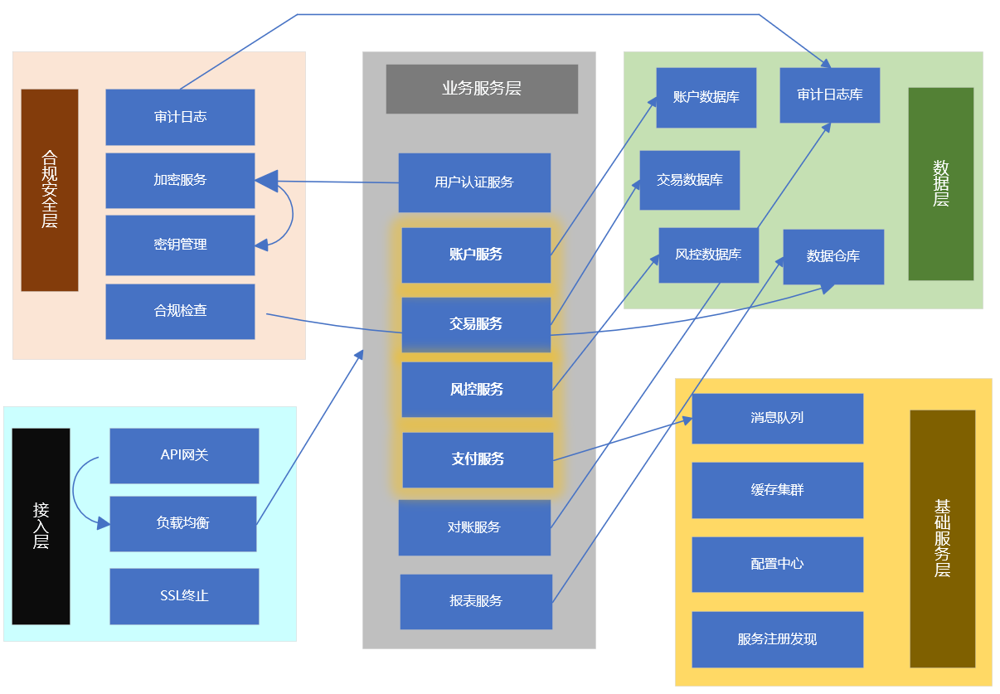

# 金融系统微服务实践

## 概述

金融系统对数据一致性、安全性和可靠性要求极高。微服务架构可以帮助金融机构实现敏捷开发、独立部署和弹性扩展，同时满足严格的合规要求。

## 架构全景

### 金融微服务架构



## 核心服务设计

### 1. 账户服务 (Account Service)
**账户管理和资金操作**

```java
@Service
@Transactional
public class AccountServiceImpl implements AccountService {
    
    @Autowired
    private AccountRepository accountRepository;
    
    @Autowired
    private TransactionService transactionService;
    
    @Autowired
    private DistributedLock lock;
    
    @Override
    public Account createAccount(Account account) {
        account.setAccountNo(generateAccountNo());
        account.setStatus(AccountStatus.ACTIVE);
        account.setCreateTime(new Date());
        account.setUpdateTime(new Date());
        
        return accountRepository.save(account);
    }
    
    @Override
    public Account getAccount(String accountNo) {
        return accountRepository.findByAccountNo(accountNo)
                .orElseThrow(() -> new AccountNotFoundException("账户不存在"));
    }
    
    @Override
    public void transfer(TransferRequest request) {
        // 获取分布式锁
        String lockKey = "transfer:" + request.getFromAccount() + ":" + request.getToAccount();
        boolean locked = lock.tryLock(lockKey, 10, TimeUnit.SECONDS);
        
        if (!locked) {
            throw new ConcurrentOperationException("转账操作冲突");
        }
        
        try {
            // 检查转出账户
            Account fromAccount = getAccount(request.getFromAccount());
            if (fromAccount.getBalance().compareTo(request.getAmount()) < 0) {
                throw new InsufficientBalanceException("余额不足");
            }
            
            // 检查转入账户
            Account toAccount = getAccount(request.getToAccount());
            if (toAccount.getStatus() != AccountStatus.ACTIVE) {
                throw new AccountException("转入账户状态异常");
            }
            
            // 执行转账
            fromAccount.setBalance(fromAccount.getBalance().subtract(request.getAmount()));
            toAccount.setBalance(toAccount.getBalance().add(request.getAmount()));
            
            accountRepository.save(fromAccount);
            accountRepository.save(toAccount);
            
            // 记录交易
            transactionService.recordTransaction(request);
            
        } finally {
            lock.unlock(lockKey);
        }
    }
    
    private String generateAccountNo() {
        return "ACC" + System.currentTimeMillis() + RandomUtils.nextInt(1000, 9999);
    }
}
```

### 2. 交易服务 (Transaction Service)
**交易记录和流水管理**

```java
@Service
public class TransactionServiceImpl implements TransactionService {
    
    @Autowired
    private TransactionRepository transactionRepository;
    
    @Autowired
    private KafkaTemplate<String, TransactionEvent> kafkaTemplate;
    
    @Override
    @Transactional
    public Transaction recordTransaction(Transaction transaction) {
        transaction.setTransactionNo(generateTransactionNo());
        transaction.setStatus(TransactionStatus.PROCESSING);
        transaction.setCreateTime(new Date());
        
        Transaction savedTransaction = transactionRepository.save(transaction);
        
        // 发送交易事件
        sendTransactionEvent(savedTransaction);
        
        return savedTransaction;
    }
    
    @Override
    public void updateTransactionStatus(String transactionNo, TransactionStatus status) {
        Transaction transaction = transactionRepository.findByTransactionNo(transactionNo)
                .orElseThrow(() -> new TransactionNotFoundException("交易记录不存在"));
        
        transaction.setStatus(status);
        transaction.setUpdateTime(new Date());
        
        transactionRepository.save(transaction);
    }
    
    @Override
    public Page<Transaction> getTransactionHistory(String accountNo, Pageable pageable) {
        return transactionRepository.findByAccountNo(accountNo, pageable);
    }
    
    private String generateTransactionNo() {
        return "TXN" + System.currentTimeMillis() + RandomUtils.nextInt(1000, 9999);
    }
    
    private void sendTransactionEvent(Transaction transaction) {
        TransactionEvent event = new TransactionEvent(transaction);
        kafkaTemplate.send("transaction-events", event);
    }
}
```

### 3. 风控服务 (Risk Control Service)
**实时风险控制和反欺诈**

```java
@Service
public class RiskControlServiceImpl implements RiskControlService {
    
    @Autowired
    private RiskRuleEngine ruleEngine;
    
    @Autowired
    private BlacklistService blacklistService;
    
    @Autowired
    private BehaviorAnalysisService behaviorAnalysisService;
    
    @Override
    public RiskAssessment assessTransaction(Transaction transaction) {
        RiskAssessment assessment = new RiskAssessment();
        assessment.setTransaction(transaction);
        
        // 检查黑名单
        if (blacklistService.isBlacklisted(transaction.getFromAccount()) ||
            blacklistService.isBlacklisted(transaction.getToAccount())) {
            assessment.setRiskLevel(RiskLevel.HIGH);
            assessment.setRejectReason("涉及黑名单账户");
            return assessment;
        }
        
        // 行为分析
        BehaviorAnalysisResult behaviorResult = behaviorAnalysisService.analyze(transaction);
        if (behaviorResult.getRiskScore() > 80) {
            assessment.setRiskLevel(RiskLevel.HIGH);
            assessment.setRejectReason("行为异常");
            return assessment;
        }
        
        // 规则引擎评估
        RuleEvaluationResult ruleResult = ruleEngine.evaluate(transaction);
        if (ruleResult.isRejected()) {
            assessment.setRiskLevel(RiskLevel.HIGH);
            assessment.setRejectReason(ruleResult.getRejectReason());
            return assessment;
        }
        
        assessment.setRiskLevel(RiskLevel.LOW);
        assessment.setApproved(true);
        
        return assessment;
    }
    
    @Override
    public void monitorTransaction(Transaction transaction) {
        // 实时监控交易行为
        CompletableFuture.runAsync(() -> {
            RealTimeMonitoringResult result = realTimeMonitor.monitor(transaction);
            if (result.requiresIntervention()) {
                riskAlertService.alert(result);
            }
        });
    }
}
```

### 4. 支付服务 (Payment Service)
**支付通道管理和资金结算**

```java
@Service
public class PaymentServiceImpl implements PaymentService {
    
    @Autowired
    private PaymentChannelRouter channelRouter;
    
    @Autowired
    private SettlementService settlementService;
    
    @Override
    public PaymentResult processPayment(PaymentRequest request) {
        // 选择支付通道
        PaymentChannel channel = channelRouter.selectChannel(request);
        
        try {
            // 执行支付
            PaymentResponse response = channel.executePayment(request);
            
            if (response.isSuccess()) {
                // 支付成功，进行结算
                settlementService.settle(request, response);
                
                return PaymentResult.success(
                    response.getTransactionId(),
                    response.getAmount(),
                    response.getFinishTime()
                );
            } else {
                return PaymentResult.failed(
                    response.getErrorCode(),
                    response.getErrorMessage()
                );
            }
            
        } catch (PaymentException e) {
            log.error("支付处理失败", e);
            return PaymentResult.failed("SYSTEM_ERROR", "系统异常");
        }
    }
    
    @Override
    public PaymentQueryResult queryPayment(String paymentId) {
        // 查询支付状态
        PaymentChannel channel = channelRouter.getChannelByPaymentId(paymentId);
        return channel.queryPayment(paymentId);
    }
    
    @Override
    public void refund(RefundRequest request) {
        PaymentChannel channel = channelRouter.getChannelByPaymentId(request.getPaymentId());
        channel.refund(request);
    }
}
```

## 数据库设计

### 账户表结构
```sql
CREATE TABLE accounts (
    id BIGINT PRIMARY KEY AUTO_INCREMENT,
    account_no VARCHAR(30) UNIQUE NOT NULL,
    user_id BIGINT NOT NULL,
    account_type VARCHAR(20) NOT NULL,
    currency VARCHAR(3) NOT NULL DEFAULT 'CNY',
    balance DECIMAL(20,4) NOT NULL DEFAULT 0,
    frozen_balance DECIMAL(20,4) NOT NULL DEFAULT 0,
    status VARCHAR(20) NOT NULL DEFAULT 'ACTIVE',
    create_time DATETIME NOT NULL,
    update_time DATETIME NOT NULL,
    version BIGINT NOT NULL DEFAULT 0,
    INDEX idx_account_no (account_no),
    INDEX idx_user_id (user_id),
    INDEX idx_status (status)
);

CREATE TABLE account_balance_log (
    id BIGINT PRIMARY KEY AUTO_INCREMENT,
    account_no VARCHAR(30) NOT NULL,
    change_type VARCHAR(20) NOT NULL,
    change_amount DECIMAL(20,4) NOT NULL,
    before_balance DECIMAL(20,4) NOT NULL,
    after_balance DECIMAL(20,4) NOT NULL,
    transaction_no VARCHAR(50),
    create_time DATETIME NOT NULL,
    INDEX idx_account_no (account_no),
    INDEX idx_transaction_no (transaction_no),
    INDEX idx_create_time (create_time)
);
```

### 交易表结构
```sql
CREATE TABLE transactions (
    id BIGINT PRIMARY KEY AUTO_INCREMENT,
    transaction_no VARCHAR(50) UNIQUE NOT NULL,
    from_account VARCHAR(30) NOT NULL,
    to_account VARCHAR(30) NOT NULL,
    amount DECIMAL(20,4) NOT NULL,
    currency VARCHAR(3) NOT NULL DEFAULT 'CNY',
    transaction_type VARCHAR(20) NOT NULL,
    status VARCHAR(20) NOT NULL DEFAULT 'PROCESSING',
    purpose VARCHAR(200),
    fee DECIMAL(20,4) DEFAULT 0,
    actual_amount DECIMAL(20,4) NOT NULL,
    channel VARCHAR(50),
    error_code VARCHAR(50),
    error_message VARCHAR(200),
    create_time DATETIME NOT NULL,
    update_time DATETIME NOT NULL,
    complete_time DATETIME,
    INDEX idx_transaction_no (transaction_no),
    INDEX idx_from_account (from_account),
    INDEX idx_to_account (to_account),
    INDEX idx_status (status),
    INDEX idx_create_time (create_time)
);

CREATE TABLE transaction_audit_log (
    id BIGINT PRIMARY KEY AUTO_INCREMENT,
    transaction_no VARCHAR(50) NOT NULL,
    old_status VARCHAR(20),
    new_status VARCHAR(20),
    operator VARCHAR(50) NOT NULL,
    operation_type VARCHAR(20) NOT NULL,
    remark VARCHAR(200),
    create_time DATETIME NOT NULL,
    INDEX idx_transaction_no (transaction_no),
    INDEX idx_operator (operator),
    INDEX idx_create_time (create_time)
);
```

### 风控表结构
```sql
CREATE TABLE risk_rules (
    id BIGINT PRIMARY KEY AUTO_INCREMENT,
    rule_code VARCHAR(50) UNIQUE NOT NULL,
    rule_name VARCHAR(100) NOT NULL,
    rule_expression TEXT NOT NULL,
    risk_level VARCHAR(20) NOT NULL,
    action VARCHAR(20) NOT NULL,
    priority INT NOT NULL DEFAULT 0,
    enabled BOOLEAN NOT NULL DEFAULT TRUE,
    description VARCHAR(200),
    create_time DATETIME NOT NULL,
    update_time DATETIME NOT NULL,
    INDEX idx_rule_code (rule_code),
    INDEX idx_enabled (enabled)
);

CREATE TABLE risk_events (
    id BIGINT PRIMARY KEY AUTO_INCREMENT,
    event_type VARCHAR(50) NOT NULL,
    transaction_no VARCHAR(50),
    account_no VARCHAR(30),
    risk_level VARCHAR(20) NOT NULL,
    risk_score DECIMAL(5,2) NOT NULL,
    trigger_rules JSON,
    action_taken VARCHAR(20),
    description TEXT,
    create_time DATETIME NOT NULL,
    INDEX idx_event_type (event_type),
    INDEX idx_transaction_no (transaction_no),
    INDEX idx_account_no (account_no),
    INDEX idx_create_time (create_time)
);
```

## 分布式事务处理

### TCC事务实现
```java
@Service
public class TransferTccService {
    
    @Autowired
    private AccountService accountService;
    
    @Autowired
    private TransactionService transactionService;
    
    @TccTransaction
    public void transfer(TransferRequest request) {
        // Try阶段：预留资源
        accountService.freezeBalance(request.getFromAccount(), request.getAmount());
        transactionService.recordTransaction(request);
    }
    
    @Confirm
    public void confirmTransfer(TransferRequest request) {
        // Confirm阶段：实际扣款
        accountService.deductBalance(request.getFromAccount(), request.getAmount());
        accountService.addBalance(request.getToAccount(), request.getAmount());
        transactionService.updateStatus(request.getTransactionNo(), TransactionStatus.SUCCESS);
    }
    
    @Cancel
    public void cancelTransfer(TransferRequest request) {
        // Cancel阶段：释放资源
        accountService.unfreezeBalance(request.getFromAccount(), request.getAmount());
        transactionService.updateStatus(request.getTransactionNo(), TransactionStatus.FAILED);
    }
}
```

### 事务补偿机制
```java
@Component
public class TransactionCompensator {
    
    @Autowired
    private AccountService accountService;
    
    @Autowired
    private TransactionRepository transactionRepository;
    
    @Scheduled(fixedDelay = 30000)
    public void compensateFailedTransactions() {
        // 查找超时未完成的交易
        List<Transaction> timeoutTransactions = transactionRepository
            .findTimeoutTransactions(TransactionStatus.PROCESSING, 300);
        
        for (Transaction transaction : timeoutTransactions) {
            try {
                // 执行补偿操作
                compensateTransaction(transaction);
            } catch (Exception e) {
                log.error("补偿交易失败: {}", transaction.getTransactionNo(), e);
            }
        }
    }
    
    private void compensateTransaction(Transaction transaction) {
        if ("TRANSFER".equals(transaction.getTransactionType())) {
            // 转账交易补偿：解冻资金
            accountService.unfreezeBalance(
                transaction.getFromAccount(),
                transaction.getAmount()
            );
        }
        
        transaction.setStatus(TransactionStatus.FAILED);
        transaction.setUpdateTime(new Date());
        transactionRepository.save(transaction);
    }
}
```

## 安全与合规

### 数据加密服务
```java
@Service
public class EncryptionServiceImpl implements EncryptionService {
    
    @Autowired
    private KeyManagementService keyManagementService;
    
    private static final String AES_ALGORITHM = "AES/GCM/NoPadding";
    private static final int GCM_TAG_LENGTH = 128;
    
    @Override
    public String encryptSensitiveData(String data, String keyId) {
        try {
            SecretKey key = keyManagementService.getKey(keyId);
            Cipher cipher = Cipher.getInstance(AES_ALGORITHM);
            
            byte[] iv = new byte[12];
            SecureRandom random = new SecureRandom();
            random.nextBytes(iv);
            
            GCMParameterSpec parameterSpec = new GCMParameterSpec(GCM_TAG_LENGTH, iv);
            cipher.init(Cipher.ENCRYPT_MODE, key, parameterSpec);
            
            byte[] encryptedData = cipher.doFinal(data.getBytes(StandardCharsets.UTF_8));
            byte[] combined = new byte[iv.length + encryptedData.length];
            
            System.arraycopy(iv, 0, combined, 0, iv.length);
            System.arraycopy(encryptedData, 0, combined, iv.length, encryptedData.length);
            
            return Base64.getEncoder().encodeToString(combined);
            
        } catch (Exception e) {
            throw new EncryptionException("数据加密失败", e);
        }
    }
    
    @Override
    public String decryptSensitiveData(String encryptedData, String keyId) {
        try {
            SecretKey key = keyManagementService.getKey(keyId);
            Cipher cipher = Cipher.getInstance(AES_ALGORITHM);
            
            byte[] combined = Base64.getDecoder().decode(encryptedData);
            byte[] iv = new byte[12];
            byte[] encrypted = new byte[combined.length - 12];
            
            System.arraycopy(combined, 0, iv, 0, 12);
            System.arraycopy(combined, 12, encrypted, 0, encrypted.length);
            
            GCMParameterSpec parameterSpec = new GCMParameterSpec(GCM_TAG_LENGTH, iv);
            cipher.init(Cipher.DECRYPT_MODE, key, parameterSpec);
            
            byte[] decryptedData = cipher.doFinal(encrypted);
            return new String(decryptedData, StandardCharsets.UTF_8);
            
        } catch (Exception e) {
            throw new EncryptionException("数据解密失败", e);
        }
    }
}
```

### 审计日志服务
```java
@Service
public class AuditServiceImpl implements AuditService {
    
    @Autowired
    private AuditLogRepository auditLogRepository;
    
    @Override
    @Async
    public void logOperation(AuditLog log) {
        // 异步记录审计日志
        auditLogRepository.save(log);
    }
    
    @Override
    public void logSensitiveOperation(SensitiveOperation operation) {
        AuditLog log = new AuditLog();
        log.setUserId(operation.getUserId());
        log.setOperationType(operation.getType());
        log.setTargetId(operation.getTargetId());
        log.setParameters(encryptParameters(operation.getParameters()));
        log.setResult(operation.getResult());
        log.setIpAddress(operation.getIpAddress());
        log.setUserAgent(operation.getUserAgent());
        log.setCreateTime(new Date());
        
        logOperation(log);
    }
    
    private String encryptParameters(Map<String, Object> parameters) {
        try {
            String json = objectMapper.writeValueAsString(parameters);
            return encryptionService.encryptSensitiveData(json, "audit_log_key");
        } catch (Exception e) {
            log.warn("审计日志参数加密失败", e);
            return "ENCRYPTION_FAILED";
        }
    }
}
```

## 性能优化

### 缓存策略
```java
@Service
public class AccountCacheService {
    
    @Autowired
    private RedisTemplate<String, Account> redisTemplate;
    
    @Autowired
    private AccountRepository accountRepository;
    
    private static final String ACCOUNT_KEY_PREFIX = "account:";
    private static final long ACCOUNT_CACHE_TTL = 300; // 5分钟
    
    public Account getAccountWithCache(String accountNo) {
        String cacheKey = ACCOUNT_KEY_PREFIX + accountNo;
        
        // 先查缓存
        Account account = redisTemplate.opsForValue().get(cacheKey);
        if (account != null) {
            return account;
        }
        
        // 缓存未命中，查数据库
        account = accountRepository.findByAccountNo(accountNo)
                .orElseThrow(() -> new AccountNotFoundException("账户不存在"));
        
        // 写入缓存（不缓存敏感信息）
        Account cachedAccount = createCacheableAccount(account);
        redisTemplate.opsForValue().set(
            cacheKey, 
            cachedAccount, 
            ACCOUNT_CACHE_TTL, 
            TimeUnit.SECONDS
        );
        
        return account;
    }
    
    public void evictAccountCache(String accountNo) {
        String cacheKey = ACCOUNT_KEY_PREFIX + accountNo;
        redisTemplate.delete(cacheKey);
    }
    
    private Account createCacheableAccount(Account account) {
        Account cached = new Account();
        cached.setAccountNo(account.getAccountNo());
        cached.setAccountType(account.getAccountType());
        cached.setCurrency(account.getCurrency());
        cached.setBalance(account.getBalance());
        cached.setStatus(account.getStatus());
        // 不缓存敏感信息如用户ID等
        return cached;
    }
}
```

### 批量处理优化
```java
@Service
public class BatchProcessingService {
    
    @Autowired
    private JdbcTemplate jdbcTemplate;
    
    public void batchUpdateAccounts(List<AccountUpdate> updates) {
        jdbcTemplate.batchUpdate(
            "UPDATE accounts SET balance = ?, update_time = ? WHERE account_no = ?",
            new BatchPreparedStatementSetter() {
                @Override
                public void setValues(PreparedStatement ps, int i) throws SQLException {
                    AccountUpdate update = updates.get(i);
                    ps.setBigDecimal(1, update.getNewBalance());
                    ps.setTimestamp(2, new Timestamp(System.currentTimeMillis()));
                    ps.setString(3, update.getAccountNo());
                }
                
                @Override
                public int getBatchSize() {
                    return updates.size();
                }
            }
        );
    }
    
    public void batchInsertTransactions(List<Transaction> transactions) {
        String sql = "INSERT INTO transactions (" +
            "transaction_no, from_account, to_account, amount, currency, " +
            "transaction_type, status, create_time, update_time" +
            ") VALUES (?, ?, ?, ?, ?, ?, ?, ?, ?)";
        
        jdbcTemplate.batchUpdate(sql, new BatchPreparedStatementSetter() {
            @Override
            public void setValues(PreparedStatement ps, int i) throws SQLException {
                Transaction transaction = transactions.get(i);
                ps.setString(1, transaction.getTransactionNo());
                ps.setString(2, transaction.getFromAccount());
                ps.setString(3, transaction.getToAccount());
                ps.setBigDecimal(4, transaction.getAmount());
                ps.setString(5, transaction.getCurrency());
                ps.setString(6, transaction.getTransactionType());
                ps.setString(7, transaction.getStatus().name());
                ps.setTimestamp(8, new Timestamp(transaction.getCreateTime().getTime()));
                ps.setTimestamp(9, new Timestamp(System.currentTimeMillis()));
            }
            
            @Override
            public int getBatchSize() {
                return transactions.size();
            }
        });
    }
}
```

## 监控与告警

### 业务监控
```java
@Component
public class FinancialMetrics {
    
    private final MeterRegistry meterRegistry;
    
    public FinancialMetrics(MeterRegistry meterRegistry) {
        this.meterRegistry = meterRegistry;
    }
    
    public void recordTransaction(String type, String status, long amount) {
        // 记录交易指标
        meterRegistry.counter("transaction.total", "type", type, "status", status).increment();
        meterRegistry.summary("transaction.amount", "type", type).record(amount);
    }
    
    public void recordTransferDuration(long duration) {
        meterRegistry.timer("transfer.duration").record(duration, TimeUnit.MILLISECONDS);
    }
    
    public void recordRiskAssessment(String riskLevel) {
        meterRegistry.counter("risk.assessment", "level", riskLevel).increment();
    }
    
    public void recordPaymentSuccess(String channel) {
        meterRegistry.counter("payment.success", "channel", channel).increment();
    }
    
    public void recordPaymentFailure(String channel, String errorCode) {
        meterRegistry.counter("payment.failure", "channel", channel, "error", errorCode).increment();
    }
}
```

### 合规监控
```java
@Service
public class ComplianceMonitor {
    
    @Autowired
    private TransactionRepository transactionRepository;
    
    @Autowired
    private AlertService alertService;
    
    @Scheduled(cron = "0 0 2 * * ?") // 每天凌晨2点执行
    public void monitorLargeTransactions() {
        // 监控大额交易
        LocalDate yesterday = LocalDate.now().minusDays(1);
        List<LargeTransaction> largeTransactions = transactionRepository
            .findLargeTransactions(yesterday, new BigDecimal("50000"));
        
        for (LargeTransaction transaction : largeTransactions) {
            ComplianceReport report = generateComplianceReport(transaction);
            if (report.requiresReporting()) {
                alertService.sendComplianceAlert(report);
            }
        }
    }
    
    @Scheduled(fixedRate = 3600000) // 每小时执行一次
    public void monitorSuspiciousActivities() {
        // 监控可疑活动
        List<SuspiciousActivity> activities = transactionRepository
            .findSuspiciousActivities(24);
        
        for (SuspiciousActivity activity : activities) {
            RiskAssessment assessment = riskService.assessSuspiciousActivity(activity);
            if (assessment.getRiskLevel() == RiskLevel.HIGH) {
                alertService.sendSuspiciousActivityAlert(activity, assessment);
            }
        }
    }
}
```

## 总结

金融系统微服务实践需要特别关注：

**核心要求：**
- 数据一致性和事务完整性
- 安全性和合规性
- 高可用性和可靠性
- 审计和监控能力

**最佳实践：**
- 采用TCC等分布式事务方案
- 实现完善的风控和反欺诈机制
- 建立全面的审计日志系统
- 设计弹性架构和故障恢复机制

> 提示：金融系统改造需要循序渐进，优先从非核心业务开始试点，逐步推广到关键业务系统。

***
*相关阅读：./distributed-transactions.md | ./system-security-architecture.md | ./high-availability-design.md*