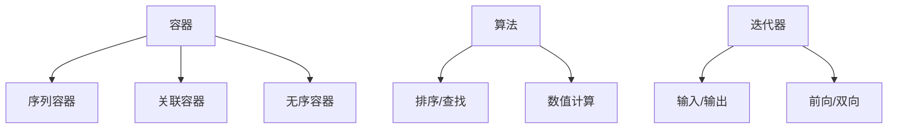

# C++ 技术全景解析

C++ 是一种高性能的通用编程语言，兼具系统编程能力和高级抽象机制。以下是 C++ 技术的全面剖析：

## 1. 语言特性概览

### 核心范式演进


### 标准版本里程碑
| 版本      | 年份   | 重大特性                          |
|-----------|--------|-----------------------------------|
| C++98     | 1998   | STL标准化                         |
| C++11     | 2011   | 自动类型推导/移动语义              |
| C++14     | 2014   | 泛型Lambda/二进制字面量           |
| C++17     | 2017   | 结构化绑定/并行算法                |
| C++20     | 2020   | 概念/协程/模块                    |

## 2. 核心语法精要

### 基础结构示例
```cpp
#include <iostream>
#include <vector>
#include <algorithm>

// 函数模板
template<typename T>
T max_value(T a, T b) {
    return a > b ? a : b;
}

int main() {
    // 自动类型推导
    auto x = 42;        // int
    auto y = 3.14;      // double
    
    // Lambda表达式
    auto print = const auto& v {
        std::cout << v << std::endl;
    };
    
    // 容器与算法
    std::vector<int> nums{1, 5, 3, 7, 2};
    std::sort(nums.begin(), nums.end());
    
    print(max_value(x, y));  // 编译错误：类型不匹配
}
```

### 现代C++特性
```cpp
// 移动语义
std::string createString() {
    std::string s(1000, 'x');
    return s;  // 触发移动构造
}

// 智能指针
auto ptr = std::make_unique<int>(42);

// 结构化绑定
auto [min, max] = std::minmax({3, 1, 4, 2});
```

## 3. 内存管理模型

### 内存布局
```
栈区 → 堆区 → 全局/静态区 → 常量区 → 代码区
  ↑       ↑
 自动    手动
 管理    管理
```

### 智能指针对比
| 类型            | 所有权语义           | 性能开销 |
|-----------------|----------------------|----------|
| unique_ptr      | 独占所有权           | 最低     |
| shared_ptr      | 共享所有权           | 中等     |
| weak_ptr        | 观察指针             | 最低     |

## 4. 标准库体系

### STL组件架构


### 常用工具
| 组件            | 典型实现              | 特性                  |
|-----------------|-----------------------|-----------------------|
| 容器           | vector/map/unordered_map | 动态数组/红黑树/哈希表 |
| 算法           | sort/find/transform   | 泛型操作              |
| 实用工具       | tuple/optional/variant | 复合类型              |
| 并发支持       | thread/atomic/future   | 多线程编程            |

## 5. 面向对象设计

### 多态实现机制
```cpp
class Shape {
public:
    virtual void draw() const = 0;  // 纯虚函数
    virtual ~Shape() = default;
};

class Circle : public Shape {
    void draw() const override {
        std::cout << "Drawing circle" << std::endl;
    }
};

// 使用示例
std::unique_ptr<Shape> shape = std::make_unique<Circle>();
shape->draw();  // 动态绑定
```

### 对象模型关键点
1. **虚函数表**：运行时多态基础
2. **内存对齐**：影响对象布局
3. **RTTI**：typeid/dynamic_cast
4. **多重继承**：菱形继承问题

## 6. 模板与泛型编程

### 概念约束(C++20)
```cpp
template<typename T>
concept Numeric = std::integral<T> || std::floating_point<T>;

template<Numeric T>
T square(T x) {
    return x * x;
}
```

### SFINAE示例
```cpp
template<typename T>
auto length(const T& t) -> decltype(t.size(), size_t()) {
    return t.size();
}

// 备用函数
size_t length(...) { return 0; }
```

## 7. 并发编程模型

### 线程管理
```cpp
#include <thread>
#include <mutex>

std::mutex mtx;

void task(int id) {
    std::lock_guard<std::mutex> lock(mtx);
    std::cout << "Thread " << id << " working\n";
}

int main() {
    std::vector<std::thread> threads;
    for (int i = 0; i < 5; ++i) {
        threads.emplace_back(task, i);
    }
    for (auto& t : threads) {
        t.join();
    }
}
```

### 原子操作
```cpp
std::atomic<int> counter{0};

void increment() {
    for (int i = 0; i < 1000; ++i) {
        counter.fetch_add(1, std::memory_order_relaxed);
    }
}
```

## 8. 性能优化技术

### 关键优化策略
1. **缓存友好**：数据局部性原则
2. **避免拷贝**：移动语义/string_view
3. **内联优化**：编译器指令
4. **SIMD指令**：向量化计算

### 编译器指令
```cpp
// 强制内联
__attribute__((always_inline)) 
inline void fastPath() { /*...*/ }

// 分支预测
if (__builtin_expect(x > 0, 1)) {
    // 大概率路径
}
```

## 9. 应用领域

### 典型应用场景
```
系统编程 → 操作系统/驱动
游戏开发 → 引擎/物理模拟
高频交易 → 低延迟系统
科学计算 → 数值计算库
嵌入式 → 资源受限环境
```

### 知名项目
- **LLVM/Clang**：编译器基础设施
- **Unreal Engine**：游戏引擎
- **TensorFlow**：机器学习框架
- **Chromium**：浏览器核心

## 10. 工具链生态

### 开发工具矩阵
| 工具          | 用途                     | 示例                 |
|---------------|--------------------------|----------------------|
| GCC/Clang     | 编译器                   | 代码生成/优化        |
| GDB/LLDB      | 调试器                   | 断点/内存检查        |
| CMake         | 构建系统                 | 跨平台构建           |
| Conan         | 包管理                   | 依赖管理             |
| Valgrind      | 内存分析                 | 泄漏检测             |

### 现代构建示例
```cmake
# CMakeLists.txt
cmake_minimum_required(VERSION 3.20)
project(ModernCpp LANGUAGES CXX)

set(CMAKE_CXX_STANDARD 20)
set(CMAKE_CXX_STANDARD_REQUIRED ON)

add_executable(demo 
    src/main.cpp
    src/core.cpp
)

target_link_libraries(demo PRIVATE 
    fmt::fmt
    Threads::Threads
)
```

## 11. 学习路线

### 进阶路径
```
C基础 → 面向对象 → 模板 → 
STL → 内存模型 → 并发 → 
元编程 → 系统设计
```

### 推荐资源
1. 《C++ Primer》(Stanley Lippman)
2. 《Effective C++》(Scott Meyers)
3. CppReference在线文档
4. ISO C++标准文档

C++ 凭借其零成本抽象和直接硬件访问能力，在性能敏感领域保持不可替代的地位。根据2023年数据：
- 系统级开发占比65%
- 游戏引擎使用率78%
- TIOBE指数排名第3
- 新标准采纳周期3-5年