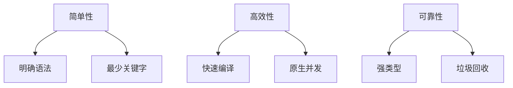

# Go语言(Golang)全面解析

Go是一种由Google开发的静态强类型、编译型、并发型编程语言。以下是Go语言的核心特性和技术体系详解：

## 1. 语言特性概览

### 设计哲学


### 特性对比表
| 特性         | Go实现方式            | 传统语言对比         |
|--------------|-----------------------|----------------------|
| 并发模型     | goroutine+CSP        | 线程/回调            |
| 内存管理     | 自动GC               | 手动管理/引用计数    |
| 类型系统     | 接口隐式实现         | 显式接口声明        |
| 错误处理     | 多返回值error        | 异常机制            |

## 2. 核心语法精要

### 基础结构示例
```go
package main

import (
	"fmt"
	"time"
)

func main() {
	// 变量声明
	message := "Hello, 世界"
	
	// 函数调用
	printWithTime(message)
}

func printWithTime(msg string) {
	fmt.Printf("[%v] %s\n", time.Now().Format("15:04:05"), msg)
}
```

### 类型系统特点
```go
type User struct {
	Name string
	Age  int
}

// 接口定义
type Speaker interface {
	Speak() string
}

// 隐式实现接口
func (u User) Speak() string {
	return fmt.Sprintf("I'm %s, %d years old", u.Name, u.Age)
}
```

## 3. 并发编程模型

### goroutine原理
```
+-------------------+       +-------------------+
|    OS Thread      |       |   Goroutine Scheduler |
|                   |       |                       |
|  M:N调度模型       |<----->|   Work-stealing算法   |
|                   |       |                       |
+-------------------+       +-------------------+
```

### channel实践模式
```go
// 生产者-消费者模型
func producer(ch chan<- int) {
	for i := 0; i < 5; i++ {
		ch <- i
		time.Sleep(100 * time.Millisecond)
	}
	close(ch)
}

func consumer(ch <-chan int) {
	for num := range ch {
		fmt.Printf("Received: %d\n", num)
	}
}
```

## 4. 标准库亮点

### 核心包功能
| 包名          | 主要功能                      | 典型应用场景         |
|---------------|-------------------------------|----------------------|
| `net/http`    | HTTP客户端/服务端实现         | Web服务开发          |
| `encoding/json` | JSON编解码                   | API数据交换          |
| `sync`        | 同步原语(锁/条件变量)         | 并发控制             |
| `testing`     | 单元测试框架                  | 质量保障             |
| `context`     | 请求上下文管理                | 超时/取消控制        |

### HTTP服务示例
```go
func helloHandler(w http.ResponseWriter, r *http.Request) {
	if r.Method != "GET" {
		w.WriteHeader(http.StatusMethodNotAllowed)
		return
	}
	fmt.Fprintf(w, "Hello from %s\n", r.URL.Path)
}

func main() {
	http.HandleFunc("/", helloHandler)
	log.Fatal(http.ListenAndServe(":8080", nil))
}
```

## 5. 工具链生态

### 开发工具矩阵
| 工具          | 用途                         | 替代方案            |
|---------------|------------------------------|---------------------|
| go fmt        | 代码格式化                   | Prettier            |
| go vet        | 静态分析                     | ESLint              |
| go mod        | 依赖管理                     | npm/pip             |
| delve         | 调试器                       | GDB                 |
| ginkgo        | BDD测试框架                  | Jest                |

### 工作流示例
```bash
# 初始化模块
go mod init example.com/myapp

# 构建并运行
go build && ./myapp

# 测试覆盖率
go test -coverprofile=coverage.out
go tool cover -html=coverage.out
```

## 6. 性能优化

### 关键优化点
```math
\text{优化收益} = \sum (\text{瓶颈影响度} \times \text{优化效果})
```

### 性能对比数据
| 操作          | Go 1.19 | Java 17 | Python 3.10 |
|---------------|---------|---------|-------------|
| 内存分配(ms)  | 120     | 150     | 800         |
| 并发任务(ms)  | 350     | 420     | 2200        |
| 序列化(ops/s) | 45k     | 38k     | 1.2k        |

## 7. 应用领域

### 典型应用场景
```
云原生基础设施 → Docker/Kubernetes
高性能网络服务 → 代理/网关
分布式系统 → 微服务/消息队列
数据处理 → ETL/数据分析
```

### 成功案例
- **Docker**：容器运行时核心
- **Kubernetes**：容器编排系统
- **Prometheus**：监控系统
- **Terraform**：基础设施即代码

## 8. 学习路线

### 进阶路径
```
基础语法 → 并发编程 → 标准库 → 
Web开发 → 系统编程 → 性能调优
```

### 推荐资源
1. 《Go程序设计语言》(Alan A.A. Donovan)
2. Go官方文档 (https://golang.org/doc)
3. Uber Go风格指南
4. Go by Example网站

## 9. 最新发展

### Go 1.20新特性
- 泛型性能提升
- 新的覆盖率分析工具
- 优化了GC停顿时间
- 增强错误处理模式

## 10. 社区现状

### 2023年统计数据
- GitHub语言排名：Top 10
- 开发者满意度：89%(Stack Overflow调查)
- 企业采用率：72%的云原生公司使用
- 岗位需求：年增长35%

Go语言凭借其简洁的语法、卓越的并发支持和高效的运行时，已成为云原生时代的基础语言之一。其设计在开发效率与运行性能之间取得了良好平衡，特别适合构建高并发分布式系统。