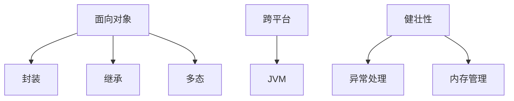
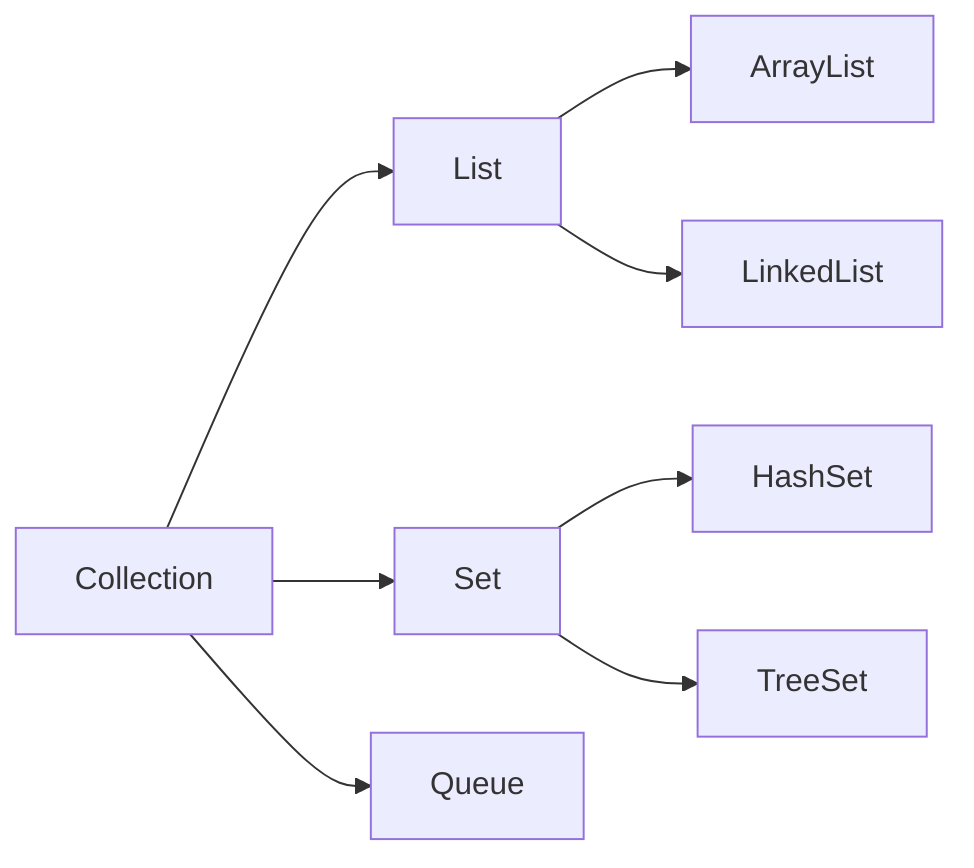

# Java 技术全景解析

Java 是一种面向对象、跨平台的高级编程语言，以其"一次编写，到处运行"的特性闻名。以下是 Java 技术的全面剖析：

## 1. 语言特性概览

### 核心设计原则


### 版本演进路线
```
JDK 1.0 (1996) → J2SE 1.2 (1998) → 
Java 5 (2004) → Java 8 (2014) → 
Java 11 (2018 LTS) → Java 17 (2021 LTS)
```

## 2. 核心语法精要

### 基础结构示例
```java
// 类定义
public class Main {
    // 主方法
    public static void main(String[] args) {
        // 变量声明
        String message = "Hello, Java!";
        int version = 17;
        
        // 控制结构
        if (version >= 11) {
            System.out.println(message + " LTS");
        }
        
        // 方法调用
        printInfo("Java", 2023);
    }
    
    // 方法定义
    static void printInfo(String tech, int year) {
        System.out.printf("%s in %d%n", tech, year);
    }
}
```

### 面向对象特性
```java
// 接口定义
interface Flyable {
    void fly();
}

// 抽象类
abstract class Animal {
    abstract void makeSound();
}

// 实现类
class Bird extends Animal implements Flyable {
    @Override
    void makeSound() {
        System.out.println("Chirp!");
    }
    
    @Override
    public void fly() {
        System.out.println("Flying with wings");
    }
}
```

## 3. JVM 体系结构

### 运行时数据区
```
方法区 → 堆 → Java栈 → 本地方法栈 → PC寄存器
  ↑           ↑
 类信息       对象实例
```

### 内存管理机制
```math
\text{GC效率} = \frac{\text{回收内存量}}{\text{停顿时间}}
```

## 4. 核心类库

### 常用包结构
| 包名            | 主要功能                  | 典型类                |
|-----------------|--------------------------|-----------------------|
| java.lang       | 基础类                   | String, Math         |
| java.util       | 集合框架                 | ArrayList, HashMap   |
| java.io         | 输入输出                 | File, InputStream    |
| java.net        | 网络编程                 | Socket, URL          |
| java.time       | 日期时间                 | LocalDateTime        |
| java.concurrent | 并发工具                 | ThreadPoolExecutor   |

### 集合框架


## 5. 并发编程

### 线程模型
```java
// 创建线程方式1：继承Thread
class MyThread extends Thread {
    public void run() {
        System.out.println("Thread running");
    }
}

// 创建线程方式2：实现Runnable
Runnable task = () -> {
    System.out.println("Lambda task");
};

// 线程池使用
ExecutorService pool = Executors.newFixedThreadPool(4);
pool.submit(task);
```

### 并发工具对比
| 工具            | 特点                      | 适用场景              |
|-----------------|--------------------------|-----------------------|
| synchronized    | 内置锁                    | 简单同步              |
| ReentrantLock   | 可重入锁                  | 复杂同步              |
| CountDownLatch  | 闭锁                     | 多线程等待            |
| ConcurrentHashMap | 线程安全Map              | 高并发访问            |

## 6. 现代Java特性

### Java 8+ 新特性
```java
// Lambda表达式
List<String> names = Arrays.asList("Alice", "Bob");
names.forEach(name -> System.out.println(name));

// Stream API
int sum = IntStream.range(1, 100)
                  .filter(n -> n % 2 == 0)
                  .sum();

// Optional类
Optional<String> opt = Optional.ofNullable(getName());
String result = opt.orElse("default");

// 模块系统 (Java 9+)
module com.example {
    requires java.base;
    exports com.example.api;
}
```

## 7. 开发工具链

### 主流工具
| 工具          | 用途                     | 替代方案            |
|---------------|--------------------------|---------------------|
| Maven         | 项目构建                 | Gradle              |
| JUnit         | 单元测试                 | TestNG              |
| IntelliJ IDEA | IDE                     | Eclipse             |
| JProfiler     | 性能分析                 | VisualVM            |
| Jenkins       | CI/CD                   | GitHub Actions      |

### 构建示例
```xml
<!-- Maven pom.xml片段 -->
<dependencies>
    <dependency>
        <groupId>org.springframework</groupId>
        <artifactId>spring-core</artifactId>
        <version>5.3.20</version>
    </dependency>
</dependencies>
```

## 8. 应用领域

### 技术栈矩阵
| 领域          | 主流框架/技术            |
|---------------|--------------------------|
| Web开发       | Spring Boot, Jakarta EE  |
| 微服务        | Spring Cloud, Micronaut  |
| 大数据        | Hadoop, Spark            |
| Android       | Android SDK              |
| 企业应用      | Hibernate, MyBatis       |

### 企业级架构
```
表现层 → 业务层 → 数据访问层
  ↑           ↑           ↑
Web MVC    事务管理      ORM/JDBC
  ↓           ↓           ↓
安全控制 ←─── AOP ───→ 缓存集成
```

## 9. 性能优化

### JVM调优参数
```bash
# 典型启动参数
java -Xms512m -Xmx2g -XX:+UseG1GC \
     -XX:MaxGCPauseMillis=200 \
     -jar app.jar
```

### 优化策略
1. **减少对象创建**：重用对象
2. **合理集合选择**：根据场景选集合
3. **并发控制**：避免过度同步
4. **IO优化**：使用缓冲/NIO

## 10. 学习路线

### 进阶路径
```
Java基础 → 集合/IO → 并发 → 
JVM原理 → 框架生态 → 架构设计
```

### 推荐资源
1. 《Java核心技术》(Cay Horstmann)
2. 《Effective Java》(Joshua Bloch)
3. Oracle官方文档
4. Java社区(JCP)技术规范

Java 凭借其稳定性、丰富的生态和跨平台能力，在企业级开发中占据主导地位。根据2023年统计：
- 全球70%的企业系统使用Java
- Android应用开发占比65%
- 云计算领域年增长25%
- 长期支持(LTS)版本采用率达80%