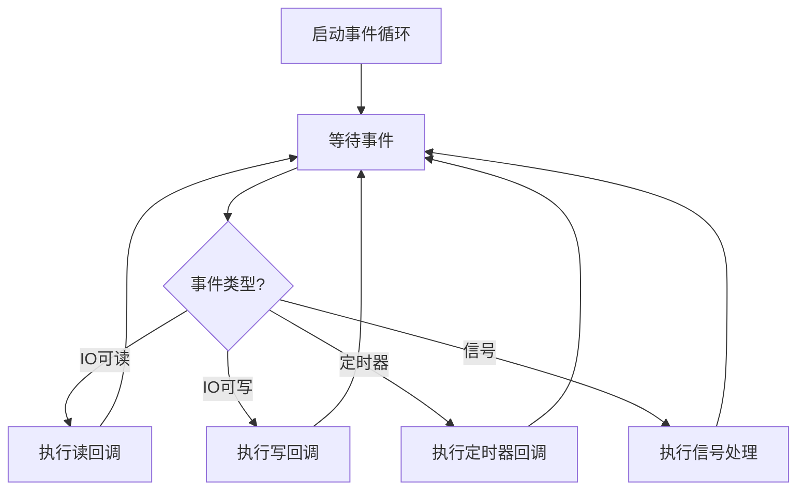
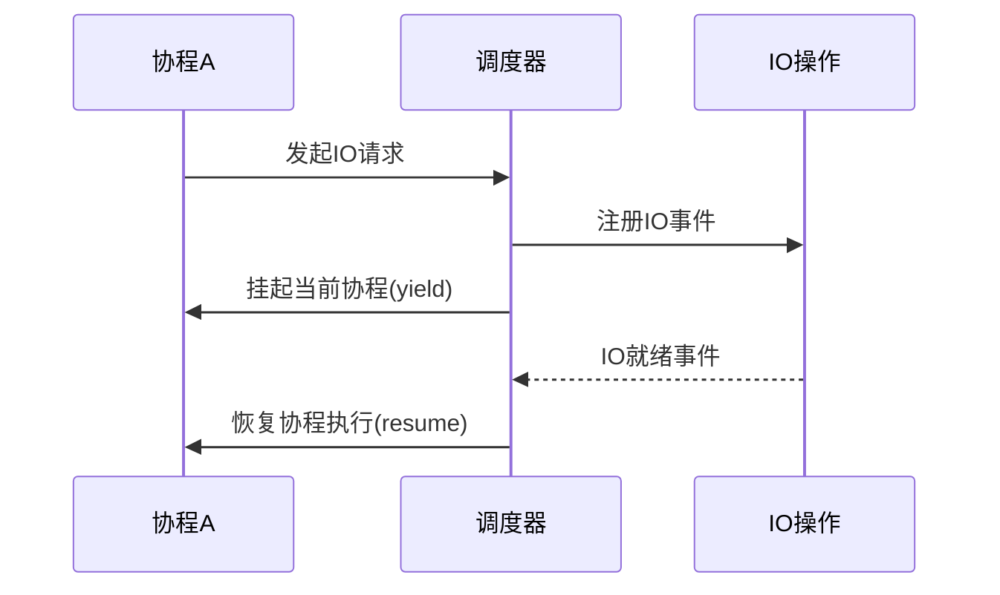
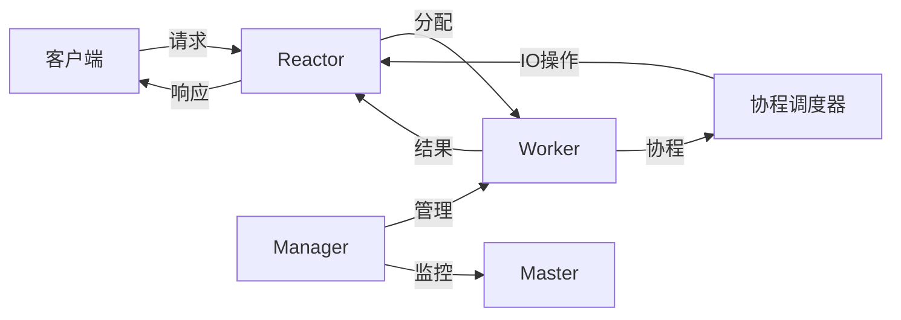

# Swoole 工作原理深度解析

Swoole 是一个高性能的 PHP 协程网络通信引擎，其工作原理涉及多个层面的技术。下面将从架构设计、事件循环、协程实现等角度详细解析 Swoole 的工作原理。

## 一、整体架构

Swoole 采用多进程+多线程+协程的混合架构：

```
Master进程 (主进程)
├── Reactor线程 (事件循环)
├── Manager进程 (管理Worker)
└── Worker进程 (业务处理)
    ├── Worker线程
    └── 协程
```

### 1. Master 进程
- 负责服务器初始化、事件监听和信号处理
- 管理 Reactor 线程和 Manager 进程
- 不处理具体业务逻辑

### 2. Reactor 线程
- 基于 epoll/kqueue 的事件循环
- 处理网络 IO 事件（接收连接、读取数据等）
- 多线程模式可配置（单线程或多线程）

### 3. Manager 进程
- 管理 Worker 进程的生命周期
- Worker 进程崩溃后自动重启
- 平滑重启时负责创建新的 Worker

### 4. Worker 进程
- 实际处理业务逻辑的进程
- 每个 Worker 进程都是独立的 PHP 解释器实例
- 可以启用协程模式

## 二、事件驱动机制

Swoole 的核心是事件驱动，其事件循环工作原理如下：



### 1. 事件类型
- **文件描述符事件**：socket 可读/可写/错误等
- **定时器事件**：定时触发的回调
- **信号事件**：进程信号处理
- **用户自定义事件**：通过 `Swoole\Event::add()` 添加

### 2. Reactor 实现
Swoole 根据操作系统选择最优的事件轮询机制：
- Linux: epoll
- macOS: kqueue
- Windows: IOCP (通过 libuv 实现)

## 三、协程实现原理

Swoole 的协程是基于 C 栈的协程（非 PHP 生成器实现），其工作原理：

### 1. 协程上下文切换
```c
// 保存当前协程上下文
getcontext(&current->ctx);

// 切换到目标协程上下文
setcontext(&target->ctx);
```

### 2. 协程调度流程



### 3. 协程与事件循环的配合

当协程遇到 IO 操作时：
1. 将 socket 设置为非阻塞
2. 注册到事件循环
3. 保存当前协程上下文
4. yield 让出控制权
5. IO 就绪后，事件循环触发回调
6. 恢复协程执行

## 四、进程间通信

Swoole 使用多种 IPC 机制：

### 1. Unix Socket
- Worker 与 Master/Manager 通信
- 全双工通信
- 高性能低延迟

### 2. 共享内存
- `Swoole\Table` 基于共享内存
- 原子计数器操作
- 进程间数据共享

### 3. 消息队列
- `Swoole\Process::useQueue()`
- 支持阻塞/非阻塞模式
- 适用于生产者消费者模型

## 五、网络协议处理

Swoole 的网络协议处理流程：

```
数据接收 → 协议解析 → 分发到Worker → 业务处理 → 协议封装 → 数据发送
```

### 1. 协议解析优化
- 固定包头+包体协议自动处理
- HTTP/WebSocket 协议全解析
- 避免 PHP 层重复解析

### 2. 发送优化
- 缓冲区管理
- 合并写操作
- 延迟发送

## 六、内存管理

### 1. 内存池
- 连接对象内存池
- 减少内存分配开销
- 避免内存碎片

### 2. 零拷贝
- 接收数据直接存入共享内存
- 避免数据从内核到用户空间的拷贝

## 七、性能优化技术

### 1. 锁优化
- 自旋锁替代互斥锁
- 原子操作替代锁
- 减少锁竞争

### 2. 上下文切换优化
- 单线程事件循环
- 协程轻量级切换
- 避免进程/线程切换开销

### 3. 系统调用优化
- 批量处理事件
- 合并系统调用
- 使用更高效的系统调用

## 八、与传统PHP模式的对比

| 特性     | 传统PHP-FPM | Swoole        |
| -------- | ----------- | ------------- |
| 运行模式 | 多进程      | 多进程+协程   |
| 生命周期 | 请求级别    | 长生命周期    |
| 并发模型 | 同步阻塞    | 异步非阻塞    |
| 内存管理 | 请求后释放  | 持久化内存    |
| IO性能   | 低          | 高            |
| 适用场景 | 短耗时请求  | 长连接/高并发 |

## 九、工作流程示例

以 HTTP 服务器为例的工作流程：

1. Master 进程绑定端口，创建 Reactor 线程
2. Reactor 接收新连接，分配给 Worker
3. Worker 接收完整 HTTP 请求
4. Worker 协程处理请求：
   ```php
   Co\run(function () {
       $mysql = new Swoole\Coroutine\MySQL();
       $mysql->connect([...]);
       $result = $mysql->query('SELECT ...');
       $redis = new Swoole\Coroutine\Redis();
       $redis->connect(...);
       $data = $redis->get('cache');
   });
   ```
5. Worker 发送 HTTP 响应
6. Reactor 将响应数据发送给客户端

## 十、核心组件交互



Swoole 的这种架构设计使其能够：
- 处理百万级并发连接
- 实现毫秒级响应
- 保持极低的内存占用
- 充分利用多核 CPU

理解这些工作原理有助于开发者更好地使用 Swoole，编写出更高性能的网络应用程序。