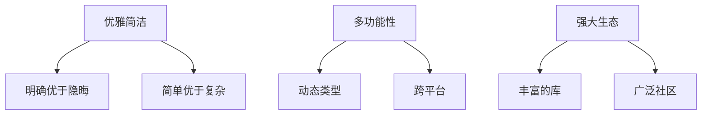
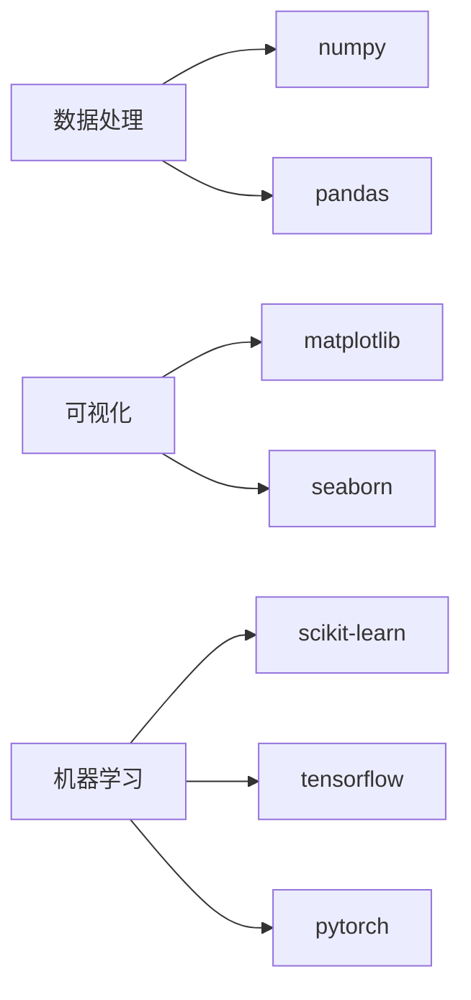

# Python 全面技术解析

Python 是一种高级、解释型、通用的编程语言，以其简洁的语法和强大的生态系统著称。以下是 Python 技术的深度剖析：

## 1. 语言特性概览

### 设计哲学


### 版本对比
| 特性        | Python 2.x      | Python 3.x       |
| ----------- | --------------- | ---------------- |
| 打印语句    | `print "hello"` | `print("hello")` |
| 除法行为    | 整数除法        | 真除法(`/`)      |
| Unicode支持 | 需前缀`u`       | 默认             |
| 迭代器协议  | `next()`方法    | `__next__()`方法 |

## 2. 核心语法精要

### 基础结构示例
```python
# 变量与类型
name = "Alice"
age = 25
height = 1.68
is_student = True

# 控制结构
if age >= 18:
    print(f"{name}是成年人")
else:
    print(f"{name}是未成年人")

# 函数定义
def greet(person):
    return f"Hello, {person}!"
```

### 特色语法
```python
# 列表推导式
squares = [x**2 for x in range(10) if x % 2 == 0]

# 字典解包
params = {'a': 1, 'b': 2}
result = {**params, 'c': 3}

# 上下文管理器
with open('data.txt', 'r') as f:
    content = f.read()
```

## 3. 面向对象编程

### 类与继承
```python
class Animal:
    def __init__(self, name):
        self.name = name
    
    def speak(self):
        raise NotImplementedError

class Dog(Animal):
    def speak(self):
        return f"{self.name} says Woof!"

class Cat(Animal):
    def speak(self):
        return f"{self.name} says Meow!"
```

### 魔术方法示例
```python
class Vector:
    def __init__(self, x, y):
        self.x = x
        self.y = y
    
    def __add__(self, other):
        return Vector(self.x + other.x, self.y + other.y)
    
    def __repr__(self):
        return f"Vector({self.x}, {self.y})"
```

## 4. 标准库亮点

### 常用模块
| 模块名        | 主要功能     | 典型用例         |
| ------------- | ------------ | ---------------- |
| `os`          | 操作系统交互 | 文件路径操作     |
| `sys`         | 系统相关参数 | 命令行参数处理   |
| `re`          | 正则表达式   | 文本模式匹配     |
| `json`        | JSON编解码   | API数据交换      |
| `datetime`    | 日期时间处理 | 时间计算与格式化 |
| `collections` | 高级数据结构 | 计数器/默认字典  |
| `itertools`   | 迭代器工具   | 组合生成         |

### 文件处理示例
```python
import csv
from pathlib import Path

# 现代文件路径处理
data_file = Path('data.csv')

# CSV读写
with data_file.open('r') as f:
    reader = csv.DictReader(f)
    for row in reader:
        print(row['name'], row['email'])
```

## 5. 并发编程模型

### 并发模式对比
| 方式   | 模块              | 适用场景      |
| ------ | ----------------- | ------------- |
| 多线程 | `threading`       | IO密集型任务  |
| 多进程 | `multiprocessing` | CPU密集型任务 |
| 异步IO | `asyncio`         | 高并发网络IO  |
| 协程   | `greenlet`        | 微线程实现    |

### asyncio示例
```python
import asyncio

async def fetch_data(url):
    print(f"开始获取 {url}")
    await asyncio.sleep(2)  # 模拟IO操作
    print(f"完成获取 {url}")
    return f"{url}的数据"

async def main():
    tasks = [
        fetch_data("https://api.example.com/users"),
        fetch_data("https://api.example.com/products")
    ]
    results = await asyncio.gather(*tasks)
    print(results)

asyncio.run(main())
```

## 6. 包管理与虚拟环境

### 工具对比
| 工具   | 用途           | 特点               |
| ------ | -------------- | ------------------ |
| pip    | 包安装         | Python官方包管理器 |
| venv   | 虚拟环境       | 内置轻量级方案     |
| conda  | 环境与包管理   | 科学计算生态首选   |
| poetry | 依赖管理与打包 | 现代项目配置       |

### 工作流示例
```bash
# 创建虚拟环境
python -m venv myenv
source myenv/bin/activate  # Linux/Mac
myenv\Scripts\activate     # Windows

# 安装依赖
pip install -r requirements.txt

# 打包发布
python setup.py sdist bdist_wheel
```

## 7. 流行框架与库

### Web开发框架
| 框架    | 特点            | 适用场景         |
| ------- | --------------- | ---------------- |
| Django  | 全功能ORM/Admin | 内容管理系统     |
| Flask   | 微框架灵活      | API服务/快速原型 |
| FastAPI | 高性能/自动文档 | 现代API开发      |
| Tornado | 异步非阻塞      | 长连接应用       |

### 数据科学栈


## 8. 性能优化

### 优化策略
```math
\text{优化收益} = \sum (\text{热点代码耗时} \times \text{优化效果})
```

### 加速技术
| 技术   | 提升幅度  | 适用场景      |
| ------ | --------- | ------------- |
| Cython | 10-100x   | 数值计算      |
| Numba  | 50-1000x  | 数组操作      |
| PyPy   | 2-10x     | 通用代码      |
| 多进程 | N倍(核数) | CPU密集型任务 |

### 性能对比示例
```python
# 原始Python代码
def compute_pi(n):
    pi = 0
    for i in range(n):
        pi += (-1)**i / (2*i + 1)
    return pi * 4

# 使用Numba加速
from numba import jit
@jit(nopython=True)
def compute_pi_fast(n):
    # 相同算法实现
    ...
```

## 9. 应用领域

### 典型应用场景
```
Web开发 → Django/Flask/FastAPI
数据科学 → Pandas/NumPy/Matplotlib
人工智能 → TensorFlow/PyTorch
自动化运维 → Ansible/Fabric
网络爬虫 → Scrapy/BeautifulSoup
```

### 成功案例
- **Instagram**：大规模Django应用
- **NASA**：科学数据分析
- **Netflix**：推荐算法与运维
- **Google**：早期开发基础设施

## 10. 学习路线

### 进阶路径
```
基础语法 → 面向对象 → 标准库 → 
Web开发/数据分析 → 并发编程 → 
性能优化 → 底层扩展
```

### 推荐资源
1. 《Python Crash Course》(Eric Matthes)
2. 《Fluent Python》(Luciano Ramalho)
3. Real Python教程网站
4. Python官方文档

Python凭借其简洁的语法、丰富的生态系统和广泛的应用场景，已成为最受欢迎的编程语言之一。根据2023年Stack Overflow开发者调查：
- Python连续6年成为最想学习的语言
- 在数据科学领域占比78%
- Web开发使用率达45%
- 机器学习框架采用率第一