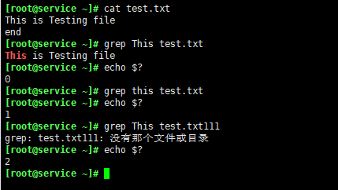
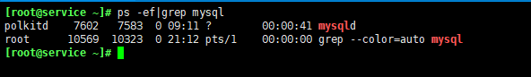
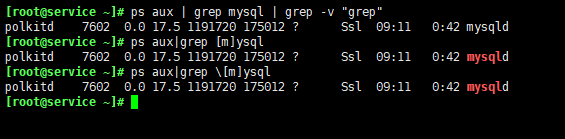
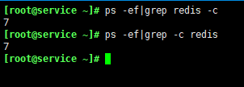
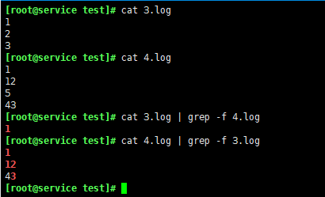
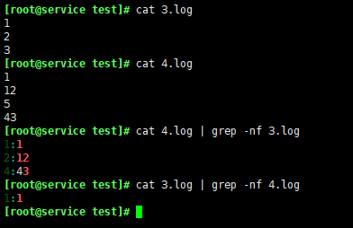
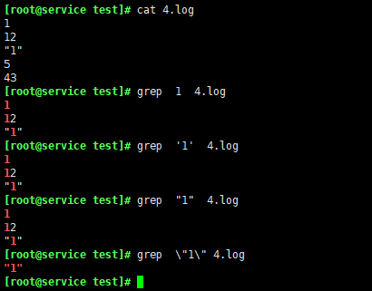
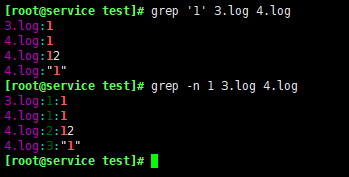

# Grep

Linux系统中grep命令是一种强大的文本搜索工具，它能使用正则表达式搜索文本，并把匹 配的行打印出来。grep全称是Global Regular Expression Print，表示全局正则表达式版本，它的使用权限是所有用户。

grep的工作方式是这样的，它在一个或多个文件中搜索字符串模板。如果*模板包括空格，则必须被引用*，模板后的所有字符串被看作文件名。搜索的结果被送到标准输出，不影响原文件内容。

## 返回状态

grep执行命令后，`$?`的值可能为：

- 0 ： 模板搜索成功
- 1 ： 搜索不成功
- 2 ： 搜索的文件不存在

> 可利用该特性进行脚本编程



## 命令格式

```bash
grep [-abcEFGhHilLnqrsvVwxy][-A<显示列数>][-B<显示列数>][-C<显示列数>][-d<进行动作>][-e<范本样式>][-f<范本文件>][--help][范本样式][文件或目录...]
```

## 命令功能

用于过滤/搜索的特定字符。可使用正则表达式能多种命令配合使用，使用上十分灵活。

命令参数

- `-a` 或 `--text` : 不要忽略二进制的数据
- `-A<显示行数>` 或 `--after-context=<显示行数>` : 除了显示符合范本样式的那一列之外，并显示该行之后的内容。
- `-b` 或 `--byte-offset` : 在显示符合样式的那一行之前，标示出该行第一个字符的编号。
- `-B<显示行数>` 或 `--before-context=<显示行数>` : 除了显示符合样式的那一行之外，并显示该行之前的内容。
- `-c` 或 `--count` : 计算符合样式的列数。
- `-C<显示行数>`<显示行数> 或 `--context=<显示行数>或-<显示行数>` : 除了显示符合样式的那一行之外，并显示该行之前后的内- 容。
- `-d` <动作> 或 `--directories=<动作>` : 当指定要查找的是目录而非文件时，必须使用这项参数，否则grep指令将回- 报信息并停止动作。
- `-e<范本样式>` 或 `--regexp=<范本样式>` : 指定字符串做为查找文件内容的样式。
- `-E` 或 `--extended-regexp` : 将样式为延伸的普通表示法来使用。
- `-f<规则文件>` 或 `--file=<规则文件>` : 指定规则文件，其内容含有一个或多个规则样式，让grep查找符合规则条件的- 文件内容，格式为每行一个规则样式。
- `-F` 或 `--fixed-regexp` : 将样式视为固定字符串的列表。
- `-G` 或 `--basic-regexp` : 将样式视为普通的表示法来使用。
- `-h` 或 `--no-filename` : 在显示符合样式的那一行之前，不标示该行所属的文件名称。
- `-H` 或 `--with-filename` : 在显示符合样式的那一行之前，表示该行所属的文件名称。
- `-i` 或 `--ignore-case` : 忽略字符大小写的差别。
- `-l` 或 `--file-with-matches` : 列出文件内容符合指定的样式的文件名称。
- `-L` 或 `--files-without-match` : 列出文件内容不符合指定的样式的文件名称。
- `-n` 或 `--line-number` : 在显示符合样式的那一行之前，标示出该行的列数编号。
- `-q` 或 `--quiet`或`--silent` : 不显示任何信息。
- `-r` 或 `--recursive` : 此参数的效果和指定`-d recurse`参数相同。
- `-s` 或 `--no-messages` : 不显示错误信息。
- `-v` 或 `--revert-match` : 显示不包含匹配文本的所有行。
- `-V` 或 `--version` : 显示版本信息。
- `-w` 或 `--word-regexp` : 只显示全字符合的列。
- `-x --line-regexp` : 只显示全列符合的列。
- `-y` 此参数的效果和指定"-i"参数相同。

## 正则表达式

- `^` 锚定行的开始 如：`^grep` 匹配所有以grep开头的行。
- `$` 锚定行的结束 如：`grep$` 匹配所有以grep结尾的行。
- `.` 匹配一个非换行符的字符 如：`gr.p` 匹配gr后接一个任意字符，然后是p。
- `*` 匹配零个或多个先前字符 如：`*grep` 匹配所有一个或多个空格后紧跟grep的行。
- `.*` 一起用代表任意字符。
- `[]` 匹配一个指定范围内的字符，如 `[Gg]rep` 匹配Grep和grep。
- `[^]` 匹配一个不在指定范围内的字符，如 `[^A-FH-Z]rep` 匹配不包含A-F和H-Z的一个字母开头，紧跟rep的行。
- `\(..)` #标记匹配字符，如 `(love)` ，love被标记为1。
- `<` 锚定单词的开始，如 `<grep` 匹配包含以grep开头的单词的行。
- `>` 锚定单词的结束，如 `grep>` 匹配包含以grep结尾的单词的行。
- `x{m}` 重复字符x，m次，如：`0{5}` 匹配包含5个o的行。
- `x{m,}` 重复字符x,至少m次，如：`o{5,}` 匹配至少有5个o的行。
- `x{m,n}` 重复字符x，至少m次，不多于n次，如： `o{5,10}` 匹配5--10个o的行。
- `\w` 匹配文字和数字字符，也就是[A-Za-z0-9]，如：`G\w*p` 匹配以G后跟零个或多个文字或数字字符，然后是p。
- `\W` \w的反置形式，匹配一个或多个非单词字符，如点号句号等。
- `\b` 单词锁定符，如: `\bgrep\b` 只匹配grep。

## POSIX字符

为了在不同国家的字符编码中保持一至，POSIX(The Portable Operating System Interface)增加了特殊的字符类，如`[:alnum:]`是`[A-Za-z0-9]`的另一个写法。要把它们放到[]号内才能成为正则表达式，如`[A- Za-z0-9]`或`[[:alnum:]]`。在linux下的grep除fgrep外，都支持POSIX的字符类

- `[:alnum:]` 文字数字字符
- `[:alpha:]` 文字字符
- `[:digit:]` 数字字符
- `[:graph:]` 非空字符（非空格、控制字符）
- `[:lower:]` 小写字符
- `[:cntrl:]` 控制字符
- `[:print:]` 非空字符（包括空格）
- `[:punct:]` 标点符号
- `[:space:]` 所有空白字符（新行，空格，制表符）
- `[:upper:]` 大写字符
- `[:xdigit:]` 十六进制数字（0-9，a-f，A-F）

## 使用实例

### 查找指定进程

```bash
ps -ef|grep mysql
```



> 除最后一条记录外，其他的都是查找出的进程；最后一条记录结果是grep进程本身，并非真正要找的进程。

### 查找指定进程时，不显示grep本身进程

```bash
ps aux | grep mysql | grep -v "grep"
ps aux|grep [m]ysql
ps aux|grep \[m]ysql
```



### 查找指定进程个数

```bash
ps -ef|grep redis -c
ps -ef|grep -c redis
```



### 从文件中读取关键词进行搜索

```bash
cat 3.log | grep -f 4.log
```



### 从文件中读取关键词进行搜索 且显示行号



### 从文件中查找关键词

```bash
grep "1" 4.log
```
> 有无引号，或者单双引号 效果是一样的，但是加上引号可读性好一点。另外如果要查询带引号的内容，需要用\进行转义



### 从多个文件中查找关键词

```bash
grep '1' 3.log 4.log 
```

> 多文件时，输出查询到的信息内容行时，会把文件的命名放在在行的最左边输出并且加上":"作为标示符分隔，如果用了-n展示行号，则第二个：的左边是行号，最右边的是匹配内容



### 找出以1开头的行内容

```bash
cat 4.log |grep ^1
```

### 找出非1开头的行内容

```bash
cat 4.log |grep ^[^1]
```

### 找出以3结尾的行内容

```bash
cat 4.log |grep 3$
```

### 在特定文件中查找内容

```bash
grep 1 *log
```

### 以递归的方式查找符合条件的文件

```bash
grep -r 1 /home/hc
```

### 反向查找

```bash
grep -v 1 *
```