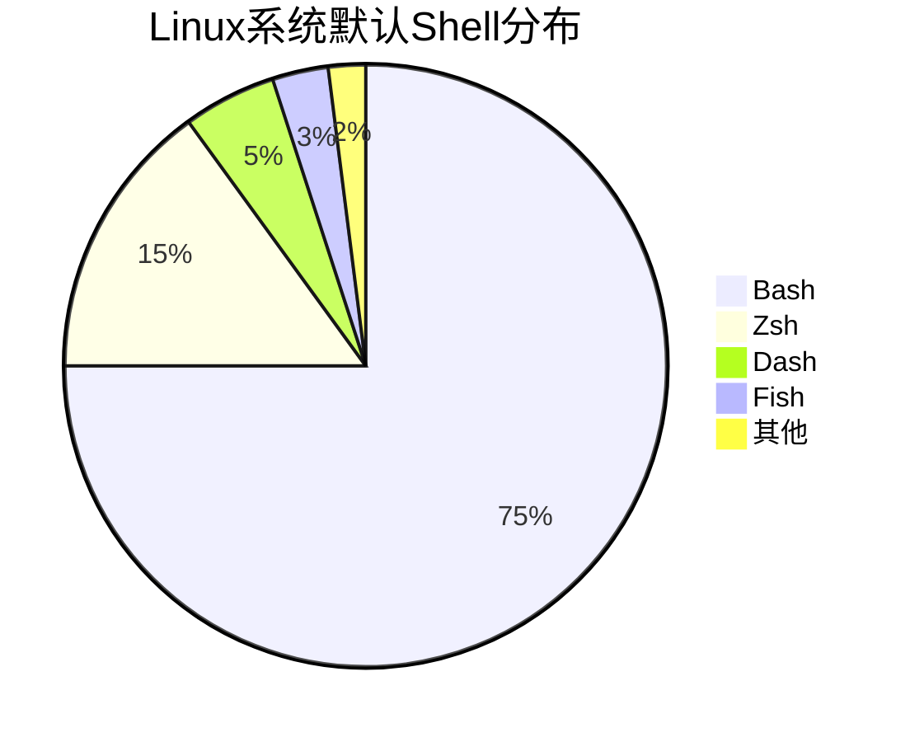
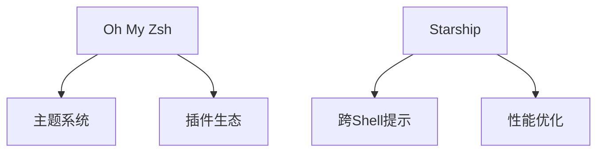

# Shell 编程全面解析

Shell 是连接用户与操作系统内核的桥梁，也是自动化运维的核心工具。以下是 Shell 技术的深度剖析：

## 1. Shell 生态概览

### 主流Shell类型


### Shell对比矩阵
| 特性          | Bash          | Zsh           | Fish          |
|---------------|---------------|---------------|---------------|
| 自动补全      | 基础          | 智能          | 上下文感知    |
| 脚本兼容性    | 最佳          | 高            | 较低          |
| 配置复杂度    | 简单          | 中等          | 易用          |
| 社区资源      | 最丰富        | 丰富          | 新兴          |

## 2. 基础语法精要

### 脚本结构示例
```bash
#!/bin/bash
# 注释：这是一个Shell脚本示例

# 变量定义
name="Shell"
version=5.0

# 函数定义
welcome() {
    local greeting="Hello, $1!"
    echo "$greeting"
}

# 主程序
welcome "$name"
echo "当前版本: $version"
```

### 关键语法元素
- **变量操作**：`${var%后缀}` `${#str}`
- **条件测试**：`[[ -f file ]]` `(( count > 0 ))`
- **循环控制**：`for i in {1..5}` `while read line`
- **命令替换**：`` `date` `` 或 `$(date)`

## 3. 进程与管道

### 进程管理命令
| 命令         | 作用                  | 示例                    |
|--------------|-----------------------|-------------------------|
| `jobs`       | 查看后台作业          | `jobs -l`               |
| `fg`         | 调至前台              | `fg %1`                 |
| `bg`         | 后台运行              | `bg %2`                 |
| `nohup`      | 脱离终端运行          | `nohup script.sh &`     |
| `disown`     | 移除作业表            | `disown -h %1`          |

### 管道高级用法
```bash
# 多级数据处理
grep "ERROR" log.txt | \
awk '{print $4}' | \
sort | uniq -c | \
sort -nr > error_stats.txt
```

## 4. 文本处理三剑客

### 工具组合技巧
```bash
# 统计日志中各状态码出现次数
awk '{print $9}' access.log | \
sort | uniq -c | \
sort -rn | \
head -5
```

### 正则表达式对比
| 工具      | 正则风格       | 特色功能               |
|-----------|----------------|------------------------|
| `grep`    | 基础正则       | 快速过滤               |
| `sed`     | 基础/扩展正则   | 流式编辑               |
| `awk`     | 扩展正则       | 字段处理               |
| `perl`    | PCRE           | 复杂模式匹配           |

## 5. 实用脚本模式

### 错误处理模板
```bash
#!/bin/bash

set -euo pipefail  # 严格模式

cleanup() {
    echo "清理临时文件..."
    rm -f temp_*
}

trap cleanup EXIT ERR

main() {
    # 业务逻辑
    if [[ ! -f config.cfg ]]; then
        echo "配置文件缺失" >&2
        return 1
    fi
}

main "$@"
```

### 常用代码片段
```bash
# 读取配置文件
while IFS='=' read -r key value; do
    config["$key"]="$value"
done < config.ini

# 时间计算
start=$(date +%s)
# 执行操作...
duration=$(( $(date +%s) - start ))
echo "耗时: ${duration}s"

# 并行处理
for file in *.log; do
    ( process "$file" ) &
done
wait
```

## 6. 系统管理实战

### 性能监控脚本
```bash
#!/bin/bash

# 监控CPU/MEM/磁盘
monitor_system() {
    local threshold=80
    while true; do
        cpu=$(top -bn1 | grep "Cpu(s)" | awk '{print $2}')
        mem=$(free -m | awk '/Mem:/ {print $3/$2*100}')
        disk=$(df -h / | awk 'NR==2 {print $5}' | tr -d '%')
        
        printf "[%(%Y-%m-%d %H:%M:%S)T] "
        printf "CPU: %.1f%% MEM: %.1f%% DISK: %s%%\n" "$cpu" "$mem" "$disk"
        
        (( $(echo "$cpu > $threshold" | bc -l) )) && \
            alert "CPU使用率超过阈值"
        
        sleep 5
    done
}
```

### 用户管理示例
```bash
# 批量创建用户
while read -r user pass; do
    if id "$user" &>/dev/null; then
        echo "$user 已存在"
    else
        useradd -m -s /bin/bash "$user"
        echo "$user:$pass" | chpasswd
    fi
done < user_list.txt
```

## 7. 安全最佳实践

### 安全防护措施
1. **输入验证**：
   ```bash
   if [[ "$input" =~ ^[a-zA-Z0-9_]+$ ]]; then
       echo "有效输入"
   else
       echo "非法字符" >&2
       exit 1
   fi
   ```

2. **权限控制**：
   ```bash
   # 检查root权限
   (( EUID != 0 )) && { echo "请使用root执行"; exit 1; }
   
   # 限制目录权限
   chmod 750 /opt/scripts
   chown root:admin /opt/scripts
   ```

3. **敏感信息处理**：
   ```bash
   # 使用环境变量传递密码
   export DB_PASS="secret"
   mysql -u user -p"$DB_PASS" -e "SHOW DATABASES"
   unset DB_PASS
   ```

## 8. 调试与优化

### 调试技巧
```bash
#!/bin/bash

set -x  # 开启调试模式
trap 'echo "错误发生在第 $LINENO 行"' ERR

# 业务代码...

set +x  # 关闭调试
```

### 性能优化点
1. **减少子进程**：
   ```bash
   # 差实践：多次调用
   for i in $(seq 1 100); do
       grep "pattern" file
   done
   
   # 好实践：单次处理
   grep "pattern" file | while read -r line; do
       process "$line"
   done
   ```

2. **使用内置命令**：
   ```bash
   # 替代外部命令
   echo "${#str}"  # 替代: wc -c
   echo "${str//old/new}"  # 替代: sed
   ```

## 9. 跨平台兼容

### 差异处理方案
| 系统特性      | Linux                | macOS               | 解决方案              |
|---------------|----------------------|---------------------|-----------------------|
| 工具版本      | GNU工具链           | BSD工具链           | 安装coreutils         |
| 路径分隔符    | /                    | /                   | 统一使用POSIX路径     |
| 命令选项      | `ls --color`         | `ls -G`             | 别名适配              |

### 兼容性检查脚本
```bash
#!/bin/bash

# 检查命令是否存在
check_cmd() {
    if ! command -v "$1" >/dev/null; then
        echo "缺失命令: $1" >&2
        return 1
    fi
}

# 必要命令列表
required=("awk" "sed" "curl" "jq")

for cmd in "${required[@]}"; do
    check_cmd "$cmd" || exit 1
done
```

## 10. 现代Shell生态

### 增强工具推荐
| 工具          | 功能                  | 安装方式              |
|---------------|-----------------------|-----------------------|
| `tmux`        | 终端复用               | `apt install tmux`    |
| `htop`        | 交互式进程查看         | `brew install htop`   |
| `jq`          | JSON处理               | `yum install jq`      |
| `fzf`         | 模糊查找               | `git clone --depth 1` |

### Shell框架选择


Shell脚本仍然是系统管理的基石，根据2023年调查：
- 78%的运维工作依赖Shell自动化
- 高级Shell程序员效率提升300%
- 结合AWK/Sed可处理90%文本处理需求
- 云环境配置中Shell脚本占比45%