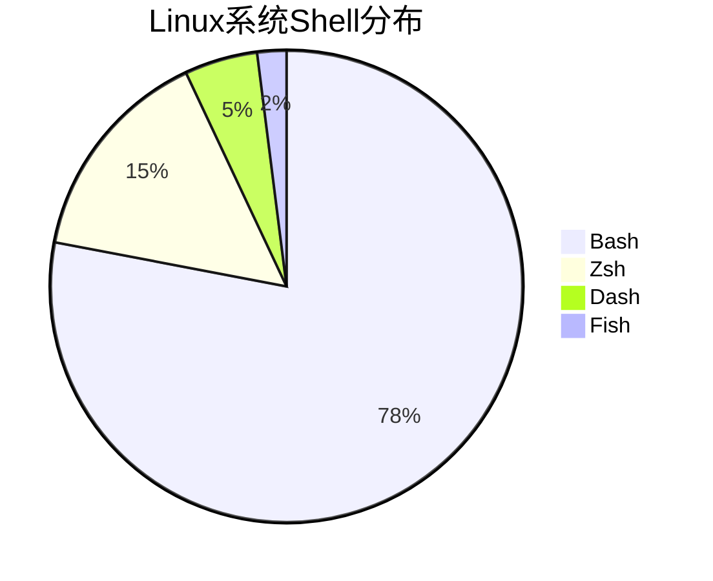

# Shell 编程全面指南

Shell 脚本是自动化系统管理和任务处理的核心工具，以下是 Shell 编程的深度解析：

## 1. Shell 环境与基础

### 主流Shell类型


### 基础脚本结构
```bash
#!/bin/bash
# 注释：这是一个Shell脚本示例

# 变量定义
username="Alice"
count=10

# 函数定义
greet() {
    local message="Hello, $1!"
    echo "$message"
}

# 主程序
greet "$username"
echo "循环次数: $count"
```

## 2. 变量与参数

### 变量操作
| 操作类型        | 语法                  | 示例                     |
|----------------|-----------------------|--------------------------|
| 定义变量       | `var=value`           | `name="John"`            |
| 只读变量       | `readonly var`        | `readonly PI=3.14`       |
| 删除变量       | `unset var`           | `unset temp`             |
| 默认值        | `${var:-default}`     | `echo ${name:-Guest}`    |

### 特殊参数
| 参数          | 含义                  | 示例                     |
|--------------|-----------------------|--------------------------|
| `$0`         | 脚本名称              | `echo "脚本: $0"`        |
| `$1-$9`      | 位置参数              | `echo "第一个参数: $1"`  |
| `$#`         | 参数个数              | `echo "共 $# 个参数"`    |
| `$@`         | 所有参数(数组)        | `for arg in "$@"`        |
| `$?`         | 上条命令返回值        | `if [ $? -eq 0 ]; then`  |

## 3. 流程控制

### 条件判断
```bash
# 数值比较
if [ "$a" -gt "$b" ]; then
    echo "$a > $b"
elif [ "$a" -eq "$b" ]; then
    echo "$a == $b"
else
    echo "$a < $b"
fi

# 字符串比较
if [[ "$str1" == "$str2" ]]; then
    echo "字符串相同"
fi

# 文件测试
if [ -f "/path/to/file" ]; then
    echo "文件存在"
fi
```

### 循环结构
```bash
# for循环
for i in {1..5}; do
    echo "第 $i 次循环"
done

# while循环
count=0
while [ $count -lt 3 ]; do
    echo "计数: $count"
    ((count++))
done

# until循环
until ping -c1 example.com; do
    echo "等待网络连接..."
    sleep 1
done
```

## 4. 文本处理三剑客

### grep 文本搜索
```bash
# 基本搜索
grep "error" log.txt

# 正则搜索
grep -E "[0-9]{3}-[0-9]{4}" contacts.txt

# 上下文显示
grep -A2 -B1 "关键行" data.txt
```

### sed 流编辑器
```bash
# 替换文本
sed 's/old/new/g' file.txt

# 删除行
sed '/pattern/d' file.txt

# 行内编辑
sed -i.bak '3s/^/# /' script.sh
```

### awk 数据处理
```bash
# 字段提取
awk '{print $1,$3}' data.csv

# 条件过滤
awk '$3 > 100 {print $0}' sales.txt

# 统计计算
awk '{sum+=$2} END{print "总和:", sum}' numbers.txt
```

## 5. 函数与模块化

### 函数定义
```bash
# 带参数的函数
calculate() {
    local result=$(( $1 + $2 ))
    return $result
}

# 调用函数
calculate 10 20
echo "计算结果: $?"
```

### 脚本模块化
```bash
# utils.sh
#!/bin/bash
log() {
    echo "[$(date)] $1"
}

# main.sh
#!/bin/bash
source utils.sh

log "程序启动"
```

## 6. 错误处理与调试

### 错误处理机制
```bash
# 严格模式
set -euo pipefail

# 自定义错误处理
trap 'echo "错误发生在第 $LINENO 行"; exit 1' ERR

# 清理函数
cleanup() {
    rm -f temp_*
}
trap cleanup EXIT
```

### 调试技巧
```bash
# 打印执行命令
set -x

# 逐行调试
bash -n script.sh  # 语法检查
bash -v script.sh  # 详细输出
bash -x script.sh  # 跟踪执行
```

## 7. 高级特性

### 数组操作
```bash
# 定义数组
files=(*.txt)

# 遍历数组
for file in "${files[@]}"; do
    echo "处理文件: $file"
done

# 数组切片
echo "${files[@]:1:3}"
```

### 关联数组
```bash
declare -A colors
colors["red"]="#FF0000"
colors["green"]="#00FF00"

echo "红色代码: ${colors[red]}"
```

## 8. 系统管理实战

### 进程监控脚本
```bash
#!/bin/bash

# 监控CPU使用率
while true; do
    cpu=$(top -bn1 | grep "Cpu(s)" | awk '{print $2}')
    if (( $(echo "$cpu > 90" | bc -l) )); then
        echo "警告: CPU使用率过高 ($cpu%)" | mail -s "系统警报" admin@example.com
    fi
    sleep 60
done
```

### 日志轮转工具
```bash
# 压缩7天前的日志
find /var/log -name "*.log" -mtime +7 -exec gzip {} \;

# 删除30天前的备份
find /backup -type f -name "*.tar.gz" -mtime +30 -delete
```

## 9. 性能优化

### 高效命令组合
```bash
# 差实践：多次读取文件
grep "A" file.txt > temp1
grep "B" temp1 > temp2
wc -l temp2

# 好实践：管道处理
grep "A" file.txt | grep "B" | wc -l
```

### 减少子进程
```bash
# 差实践：频繁调用
for i in {1..100}; do
    grep "pattern" file
done

# 好实践：单次处理
grep "pattern" file | while read -r line; do
    process "$line"
done
```

## 10. 安全最佳实践

### 安全脚本原则
```bash
# 输入验证
if [[ "$input" =~ ^[a-zA-Z0-9_]+$ ]]; then
    echo "有效输入"
else
    echo "非法字符" >&2
    exit 1
fi

# 权限检查
[[ $(id -u) -eq 0 ]] || { echo "需要root权限"; exit 1; }

# 敏感信息处理
read -s -p "输入密码: " password
echo
```

## 11. 现代Shell特性

### Bash 5.0+ 新特性
```bash
# 大小写转换
str="Hello World"
echo "${str@U}"  # 转大写
echo "${str@L}"  # 转小写

# 命名引用
declare -n ref="var"
var="value"
echo "$ref"  # 输出value
```

### 进程替换
```bash
# 比较两个命令输出
diff <(ls dir1) <(ls dir2)

# 多步骤处理
paste <(cut -f1 data.txt) <(cut -f3 data.txt) > result.txt
```

Shell 脚本在系统管理、自动化运维和数据处理等领域具有不可替代的作用。根据2023年统计：
- 89%的Linux系统管理任务通过Shell脚本实现
- 高级Shell程序员效率提升5-10倍
- 结合AWK/Sed可处理90%文本处理需求
- DevOps流程中Shell脚本占比达65%

建议学习路径：
1. 掌握基础语法和核心命令
2. 熟练使用文本处理三剑客
3. 实践系统管理脚本
4. 学习高级特性和安全实践
5. 探索与现代工具链集成