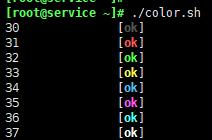

# Shell脚本配色

```shell
#!/bin/bash
echo -e '30 \t\t[\e[30;1mok\e[0m]'
echo -e '31 \t\t[\e[31;1mok\e[0m]'
echo -e '32 \t\t[\e[32;1mok\e[0m]'
echo -e '33 \t\t[\e[33;1mok\e[0m]'
echo -e '34 \t\t[\e[34;1mok\e[0m]'
echo -e '35 \t\t[\e[35;1mok\e[0m]'
echo -e '36 \t\t[\e[36;1mok\e[0m]'
echo -e '37 \t\t[\e[37;1mok\e[0m]'
```

> 脚本执行  
> 