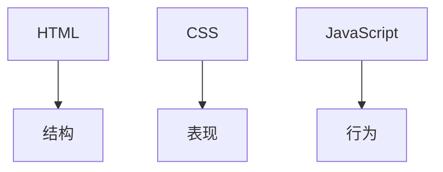
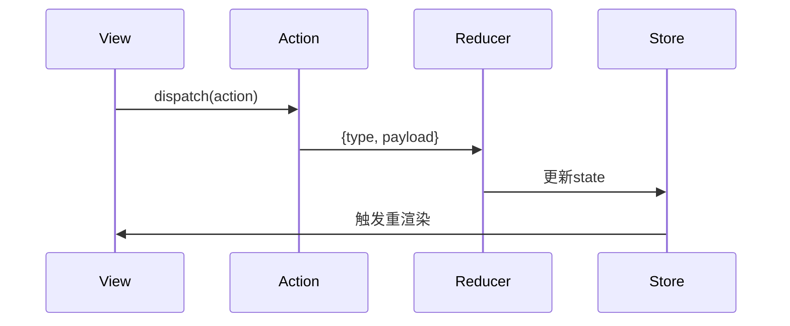
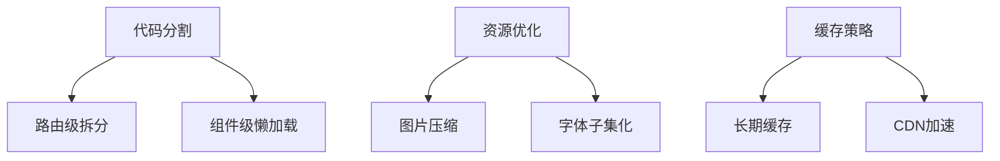

# Web 前端技术全景解析

Web 前端开发是构建现代互联网应用的关键环节，涵盖从基础页面结构到复杂交互应用的完整技术体系。以下是 Web 前端技术的全面剖析：

## 1. 核心技术栈

### 三件套基础




### 版本演进
| 技术       | 里程碑版本       | 重大改进                     |
|------------|------------------|-----------------------------|
| HTML       | HTML5 (2014)     | 语义化标签/多媒体支持         |
| CSS        | CSS3 (2011)      | 动画/弹性布局/变量            |
| JavaScript | ES6 (2015)       | 类/模块/箭头函数              |

## 2. 现代前端框架

### 主流框架对比
| 框架        | 特点                      | 适用场景               |
|------------|--------------------------|-----------------------|
| React      | 虚拟DOM/组件化            | 复杂SPA/跨平台         |
| Vue        | 渐进式/响应式             | 快速原型/企业应用       |
| Angular    | 完整MVC/TypeScript        | 大型企业应用           |
| Svelte     | 编译时优化                | 性能敏感应用           |

### React 组件示例
```jsx
import { useState } from 'react';

function Counter() {
  const [count, setCount] = useState(0);

  return (
    <div>
      <p>点击次数: {count}</p>
      <button onClick={() => setCount(c => c + 1)}>
        增加
      </button>
    </div>
  );
}
```

## 3. 状态管理方案

### 状态管理演进
```
组件状态 → Context API → Redux → MobX → Recoil → Zustand
```

### Redux 数据流


### 现代方案对比
| 方案          | 优点                  | 缺点                |
|--------------|-----------------------|---------------------|
| Redux Toolkit | 标准化/可预测         | 样板代码多          |
| MobX         | 响应式/简洁           | 黑盒调试难          |
| Recoil       | 原子化/精细更新       | 生态较新            |

## 4. 前端工程化

### 构建工具链
```
编辑器 → 包管理 → 构建工具 → 编译器 → 打包器 → 部署
  ↑           ↑           ↑           ↑           ↑
VSCode      npm/yarn    webpack      Babel       CI/CD
```

### webpack 配置示例
```javascript
module.exports = {
  entry: './src/index.js',
  output: {
    filename: 'bundle.js',
    path: path.resolve(__dirname, 'dist'),
  },
  module: {
    rules: [
      {
        test: /\.jsx?$/,
        use: 'babel-loader'
      },
      {
        test: /\.css$/,
        use: ['style-loader', 'css-loader']
      }
    ]
  }
};
```

## 5. CSS 新特性

### 现代CSS技术
| 技术              | 说明                      | 示例                     |
|-------------------|--------------------------|--------------------------|
| Flexbox           | 弹性布局                  | `display: flex`          |
| Grid              | 网格布局                  | `grid-template-columns`  |
| Custom Properties | CSS变量                   | `--primary-color: #1890ff`|
| Container Queries | 容器查询                  | `@container (width > 600px)` |

### CSS-in-JS 示例
```javascript
// styled-components
const Button = styled.button`
  background: ${props => props.primary ? "#1890ff" : "white"};
  color: ${props => props.primary ? "white" : "#1890ff"};
  font-size: 1em;
  padding: 0.5em 1em;
  border: 2px solid #1890ff;
  border-radius: 4px;
`;

// 使用
<Button primary>主要按钮</Button>
```

## 6. 前端性能优化

### 关键优化指标
| 指标              | 目标值        | 测量工具              |
|-------------------|--------------|-----------------------|
| FCP (首次内容绘制) | <1.5s        | Lighthouse            |
| TTI (可交互时间)   | <3s          | WebPageTest           |
| CLS (布局偏移)     | <0.1         | Chrome DevTools       |
| Bundle Size       | <200KB       | webpack-bundle-analyzer |

### 优化策略


## 7. 测试策略

### 测试金字塔
```
        E2E测试
          ↑
    集成测试
      ↑ ↑ ↑
  单元测试
```

### 测试工具组合
| 测试类型      | 工具                | 特点                  |
|--------------|---------------------|-----------------------|
| 单元测试      | Jest/Vitest        | 快速/隔离             |
| 组件测试      | Testing Library    | 用户行为模拟          |
| E2E测试       | Cypress/Playwright | 真实浏览器环境        |

### Jest 测试示例
```javascript
test('adds 1 + 2 to equal 3', () => {
  expect(sum(1, 2)).toBe(3);
});

// 组件测试
test('renders button', () => {
  render(<Button>Click</Button>);
  expect(screen.getByText('Click')).toBeInTheDocument();
});
```

## 8. 跨平台开发

### 解决方案对比
| 方案            | 技术栈          | 性能    | 开发效率 |
|----------------|----------------|--------|----------|
| React Native   | JavaScript     | 中高    | 高        |
| Flutter        | Dart           | 高      | 中        |
| NativeScript   | Angular/Vue    | 中      | 高        |
| 小程序          | 各平台语法      | 高      | 低        |

### React Native 示例
```javascript
import { View, Text } from 'react-native';

function App() {
  return (
    <View style={{ flex: 1, justifyContent: 'center' }}>
      <Text>Hello World!</Text>
    </View>
  );
}
```

## 9. 前沿技术趋势

### Web 新特性
| 技术              | 状态            | 应用场景               |
|-------------------|----------------|-----------------------|
| WebAssembly      | W3C标准         | 高性能计算             |
| Web Components   | 浏览器原生支持   | 跨框架组件             |
| WebRTC           | 广泛支持         | 实时通信               |
| WebGL/WebGPU     | 图形加速         | 3D可视化/游戏          |

### WebAssembly 示例
```javascript
// 加载Wasm模块
const importObject = {
  env: {
    memoryBase: 0,
    tableBase: 0,
    memory: new WebAssembly.Memory({ initial: 256 }),
    table: new WebAssembly.Table({ initial: 0, element: 'anyfunc' })
  }
};

WebAssembly.instantiateStreaming(fetch('module.wasm'), importObject)
  .then(obj => {
    console.log(obj.instance.exports.add(1, 2)); // 3
  });
```

## 10. 全栈能力扩展

### 前后端协作模式
```
BFF层 → GraphQL → 微服务 → 数据库
  ↑           ↑           ↑
前端        API网关      后端
```

### Node.js 中间件示例
```javascript
const express = require('express');
const app = express();

app.use(express.json());

app.get('/api/data', (req, res) => {
  res.json({ message: 'Hello from BFF!' });
});

app.listen(3000, () => {
  console.log('BFF服务运行中');
});
```

## 11. 开发者工具

### 必备工具集
| 工具类型        | 推荐工具            | 用途                  |
|----------------|---------------------|-----------------------|
| 调试工具        | Chrome DevTools     | DOM检查/性能分析       |
| 代码质量        | ESLint/Prettier     | 静态检查/格式化        |
| 接口调试        | Postman/Insomnia   | API测试               |
| 版本控制        | Git/GitHub          | 代码管理              |

### ESLint 配置示例
```json
{
  "extends": ["airbnb", "prettier"],
  "rules": {
    "react/prop-types": "off",
    "import/prefer-default-export": "off"
  }
}
```

Web 前端技术持续快速演进，2023年关键趋势：
- TypeScript采用率达78%
- 微前端架构增长45%
- Web Components生态成熟度提升
- 低代码平台渗透率30%
- WASM在性能敏感场景应用增加

建议开发者：
1. 夯实JavaScript基础
2. 掌握至少一个主流框架
3. 关注Web平台新特性
4. 培养全栈思维
5. 持续学习工程化实践