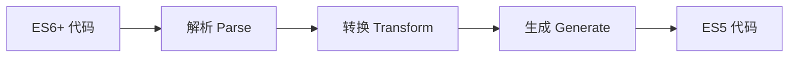

# Babel 转译配置指南

Babel 是一个 JavaScript 编译器，用于将 ES6+ 代码转换为向后兼容的 JavaScript 版本。本指南将详细介绍 Babel 的配置、插件和最佳实践。

## 核心概念

### 1. Babel 工作原理



### 2. 基础配置文件

```javascript
// babel.config.js (推荐)
module.exports = {
  presets: [
    ['@babel/preset-env', {
      targets: {
        browsers: ['> 1%', 'last 2 versions']
      },
      useBuiltIns: 'usage',
      corejs: 3
    }]
  ],
  plugins: [
    '@babel/plugin-transform-runtime'
  ]
};

// .babelrc.json (替代方案)
{
  "presets": ["@babel/preset-env"],
  "plugins": []
}
```

## 预设 (Presets) 配置

### 1. @babel/preset-env

```javascript
module.exports = {
  presets: [
    ['@babel/preset-env', {
      // 目标环境配置
      targets: {
        browsers: [
          '> 1%',           // 全球使用率 > 1% 的浏览器
          'last 2 versions', // 每个浏览器的最后两个版本
          'not ie <= 8'     // 排除 IE8 及以下
        ],
        node: 'current'     // 当前 Node.js 版本
      },
      
      // 模块转换方式
      modules: false,        // 保留 ES6 模块语法
      
      // polyfill 策略
      useBuiltIns: 'usage',  // 按需引入 polyfill
      corejs: 3,            // 使用 core-js 版本
      
      // 调试选项
      debug: false,          // 启用调试输出
      
      // 其他选项
      shippedProposals: true // 包含已进入标准的提案
    }]
  ]
};
```

### 2. React 预设

```javascript
module.exports = {
  presets: [
    ['@babel/preset-env', {
      targets: {
        browsers: ['> 1%', 'last 2 versions']
      }
    }],
    ['@babel/preset-react', {
      runtime: 'automatic',  // 使用新的 JSX 转换
      development: process.env.NODE_ENV === 'development'
    }]
  ]
};
```

### 3. TypeScript 预设

```javascript
module.exports = {
  presets: [
    '@babel/preset-env',
    '@babel/preset-typescript', // 处理 TypeScript
    ['@babel/preset-react', {
      runtime: 'automatic'
    }]
  ]
};
```

## 插件 (Plugins) 配置

### 1. 常用插件

```javascript
module.exports = {
  plugins: [
    // 类属性提案
    '@babel/plugin-proposal-class-properties',
    
    // 私有方法提案
    '@babel/plugin-proposal-private-methods',
    
    // 私有属性提案
    '@babel/plugin-proposal-private-property-in-object',
    
    // 装饰器提案
    ['@babel/plugin-proposal-decorators', {
      legacy: true
    }],
    
    // 动态导入
    '@babel/plugin-syntax-dynamic-import',
    
    // 可选链操作符
    '@babel/plugin-proposal-optional-chaining',
    
    // 空值合并操作符
    '@babel/plugin-proposal-nullish-coalescing-operator'
  ]
};
```

### 2. @babel/plugin-transform-runtime

```javascript
module.exports = {
  plugins: [
    ['@babel/plugin-transform-runtime', {
      corejs: 3,                    // 使用 core-js 3
      helpers: true,                // 提取辅助函数
      regenerator: true,            // 使用 regenerator runtime
      useESModules: false           // 是否使用 ES 模块
    }]
  ]
};
```

### 3. 自定义插件顺序

```javascript
module.exports = {
  // 插件执行顺序：从下到上，从后到前
  plugins: [
    // Stage 3 提案
    '@babel/plugin-syntax-import-assertions',
    
    // Stage 2 提案
    '@babel/plugin-proposal-decorators',
    
    // Stage 1 提案
    '@babel/plugin-proposal-optional-catch-binding',
    
    // 语法转换
    '@babel/plugin-transform-arrow-functions',
    
    // 辅助函数处理（应该放在最后）
    '@babel/plugin-transform-runtime'
  ]
};
```

## 环境特定配置

### 1. 多环境配置

```javascript
// babel.config.js
module.exports = (api) => {
  // 缓存配置
  api.cache.using(() => process.env.NODE_ENV);
  
  const presets = [
    ['@babel/preset-env', {
      targets: {
        browsers: ['> 1%', 'last 2 versions']
      },
      modules: api.env('test') ? 'commonjs' : false
    }]
  ];
  
  const plugins = [
    '@babel/plugin-transform-runtime'
  ];
  
  // 开发环境特定配置
  if (process.env.NODE_ENV === 'development') {
    plugins.push('react-refresh/babel');
  }
  
  return {
    presets,
    plugins,
    
    // 测试环境配置
    env: {
      test: {
        presets: [
          ['@babel/preset-env', {
            targets: {
              node: 'current'
            }
          }]
        ]
      }
    }
  };
};
```

### 2. 浏览器 vs Node.js 配置

```javascript
module.exports = {
  // 浏览器配置
  presets: [
    ['@babel/preset-env', {
      targets: {
        browsers: ['> 1%', 'last 2 versions']
      },
      useBuiltIns: 'entry',
      corejs: 3
    }]
  ],
  
  // Node.js 配置（覆盖）
  overrides: [{
    test: './server/**/*.js',
    presets: [
      ['@babel/preset-env', {
        targets: {
          node: 'current'
        },
        modules: 'commonjs'
      }]
    ]
  }]
};
```

## Polyfill 策略

### 1. 各种 Polyfill 方案对比

```javascript
// 方案1: useBuiltIns: 'entry' - 入口文件引入
// 需要在入口文件顶部添加:
import 'core-js/stable';
import 'regenerator-runtime/runtime';

module.exports = {
  presets: [
    ['@babel/preset-env', {
      useBuiltIns: 'entry',
      corejs: 3
    }]
  ]
};

// 方案2: useBuiltIns: 'usage' - 按需引入
module.exports = {
  presets: [
    ['@babel/preset-env', {
      useBuiltIns: 'usage',
      corejs: 3
    }]
  ]
};

// 方案3: @babel/plugin-transform-runtime - 避免全局污染
module.exports = {
  presets: [
    ['@babel/preset-env', {
      useBuiltIns: false // 禁用 preset-env 的 polyfill
    }]
  ],
  plugins: [
    ['@babel/plugin-transform-runtime', {
      corejs: 3
    }]
  ]
};
```

### 2. Core-JS 配置

```javascript
module.exports = {
  presets: [
    ['@babel/preset-env', {
      useBuiltIns: 'usage',
      corejs: {
        version: 3,
        proposals: true // 包含提案阶段的 polyfill
      }
    }]
  ]
};
```

## 集成配置

### 1. Webpack 集成

```javascript
// webpack.config.js
module.exports = {
  module: {
    rules: [
      {
        test: /\.js$/,
        exclude: /node_modules/,
        use: {
          loader: 'babel-loader',
          options: {
            presets: [
              ['@babel/preset-env', {
                targets: {
                  browsers: ['> 1%', 'last 2 versions']
                }
              }]
            ],
            cacheDirectory: true // 启用缓存
          }
        }
      }
    ]
  }
};
```

### 2. Jest 集成

```javascript
// package.json
{
  "jest": {
    "transform": {
      "^.+\\.jsx?$": "babel-jest"
    },
    "transformIgnorePatterns": [
      "node_modules/(?!(my-module)/)" // 排除特定模块
    ]
  }
}

// babel.config.js
module.exports = {
  presets: [
    ['@babel/preset-env', {
      targets: {
        node: 'current'
      }
    }]
  ]
};
```

### 3. ESLint 集成

```javascript
// .eslintrc.js
module.exports = {
  parser: '@babel/eslint-parser',
  parserOptions: {
    requireConfigFile: false,
    babelOptions: {
      presets: ['@babel/preset-env']
    }
  },
  env: {
    browser: true,
    es6: true
  }
};
```

## 高级配置

### 1. 自定义插件开发

```javascript
// custom-plugin.js
module.exports = function({ types: t }) {
  return {
    visitor: {
      // 转换箭头函数
      ArrowFunctionExpression(path) {
        if (!path.node.async) {
          path.node.type = 'FunctionExpression';
        }
      },
      
      // 转换类属性
      ClassProperty(path) {
        if (path.node.static) {
          // 处理静态属性
        }
      }
    }
  };
};

// 使用自定义插件
module.exports = {
  plugins: [
    './path/to/custom-plugin.js'
  ]
};
```

### 2. 条件编译

```javascript
module.exports = {
  plugins: [
    ['babel-plugin-jsx-remove-data-test-id', {
      attributes: 'data-test-id'
    }],
    
    // 根据环境移除代码
    ['babel-plugin-transform-remove-console', {
      exclude: ['error', 'warn'] // 保留 error 和 warn
    }]
  ],
  
  env: {
    production: {
      plugins: [
        'babel-plugin-transform-remove-debugger'
      ]
    }
  }
};
```

## 性能优化

### 1. 缓存配置

```javascript
module.exports = {
  // 环境变量变化时重新构建
  cacheDirectory: true,
  
  // 更细粒度的缓存控制
  cacheCompression: false,
  cacheIdentifier: JSON.stringify({
    env: process.env.NODE_ENV,
    babel: require('@babel/core').version
  }),
  
  // 排除不需要编译的文件
  exclude: [
    /node_modules\/core-js/,
    /node_modules\/webpack/
  ]
};
```

### 2. 构建优化

```javascript
module.exports = {
  // 仅编译源代码
  include: [
    './src/**/*.js',
    './src/**/*.jsx',
    './src/**/*.ts',
    './src/**/*.tsx'
  ],
  
  // 忽略的文件模式
  ignore: [
    '**/*.spec.js',
    '**/*.test.js',
    '**/__tests__/**'
  ],
  
  // 源映射配置
  sourceMaps: true,
  sourceType: 'unambiguous'
};
```

## 调试和问题排查

### 1. 调试配置

```javascript
module.exports = {
  presets: [
    ['@babel/preset-env', {
      debug: true, // 启用调试输出
      targets: {
        browsers: ['> 1%', 'last 2 versions']
      }
    }]
  ],
  
  // 显示详细的错误信息
  compact: false,
  comments: true
};
```

### 2. 常见问题解决

```javascript
// 问题1: 重复的 polyfill
module.exports = {
  presets: [
    ['@babel/preset-env', {
      useBuiltIns: 'usage',
      corejs: 3,
      exclude: [ // 排除可能重复的转换
        'transform-typeof-symbol',
        'transform-regenerator'
      ]
    }]
  ]
};

// 问题2: 模块转换冲突
module.exports = {
  presets: [
    ['@babel/preset-env', {
      modules: 'auto' // 让 Babel 自动决定
    }]
  ]
};

// 问题3: 大型代码库性能
module.exports = {
  // 启用并行处理
  env: {
    development: {
      compact: false
    },
    production: {
      compact: true
    }
  }
};
```

## 最佳实践

### 1. 配置文件组织

```
project/
├── babel.config.js           # 根配置文件
├── packages/
│   ├── app/
│   │   └── babel.config.js  # 应用特定配置
│   └── common/
│       └── babel.config.js  # 公共库配置
└── scripts/
    └── babel/               # 自定义插件和预设
        ├── plugins/
        └── presets/
```

### 2. 版本管理策略

```javascript
// package.json 片段
{
  "devDependencies": {
    "@babel/core": "^7.22.0",
    "@babel/preset-env": "^7.22.0",
    "@babel/runtime": "^7.22.0",
    "@babel/plugin-transform-runtime": "^7.22.0",
    "core-js": "^3.30.0"
  },
  "browserslist": [
    "> 1%",
    "last 2 versions",
    "not ie <= 11"
  ]
}

// .browserslistrc (推荐)
> 1%
last 2 versions
not dead
not ie <= 11
```

### 3. 现代化配置示例

```javascript
// babel.config.js
module.exports = {
  assumptions: {
    setPublicClassFields: true,
    privateFieldsAsSymbols: true
  },
  
  presets: [
    ['@babel/preset-env', {
      bugfixes: true,
      targets: {
        esmodules: true
      },
      useBuiltIns: 'usage',
      corejs: 3
    }],
    
    ['@babel/preset-react', {
      runtime: 'automatic'
    }]
  ],
  
  plugins: [
    ['@babel/plugin-transform-runtime', {
      corejs: false,
      version: '^7.22.0'
    }]
  ],
  
  env: {
    test: {
      presets: [
        ['@babel/preset-env', {
          targets: {
            node: 'current'
          }
        }]
      ]
    }
  }
};
```

## 迁移指南

### 1. 从 Babel 6 迁移到 7

```javascript
// Babel 6 配置
{
  "presets": ["es2015", "react"],
  "plugins": ["transform-class-properties"]
}

// Babel 7 配置
{
  "presets": [
    ["@babel/preset-env", {
      "targets": {
        "browsers": ["> 1%", "last 2 versions"]
      }
    }],
    ["@babel/preset-react", {
      "runtime": "automatic"
    }]
  ],
  "plugins": [
    "@babel/plugin-proposal-class-properties"
  ]
}
```

### 2. 从 @babel/polyfill 迁移

```javascript
// 旧方式
import '@babel/polyfill';

// 新方式
import 'core-js/stable';
import 'regenerator-runtime/runtime';

// 或者使用 useBuiltIns: 'entry'
module.exports = {
  presets: [
    ['@babel/preset-env', {
      useBuiltIns: 'entry',
      corejs: 3
    }]
  ]
};
```
