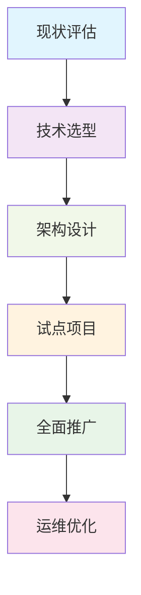

# 微前端架构

微前端是一种将前端应用程序分解为独立、可独立开发和部署的小型应用的架构风格。本指南将深入探讨微前端的实现模式、工具选择和最佳实践。

## 核心概念与模式

### 1. 微前端架构模式对比

| 模式 | 描述 | 优点 | 缺点 | 适用场景 |
|------|------|------|------|----------|
| **基座模式** | 主应用协调子应用 | 集中控制、统一路由 | 单点故障、基座复杂 | 传统迁移、统一体验 |
| **自组织模式** | 应用间直接通信 | 去中心化、灵活 | 协调困难、复杂度高 | 成熟团队、简单应用 |
| **微应用模式** | iframe 嵌入 | 完全隔离、简单 | 体验差、通信复杂 | 遗留系统集成 |
| **模块联邦** | Webpack 5 特性 | 运行时集成、代码共享 | Webpack 绑定、较新 | 现代应用、代码共享 |

### 2. 架构决策框架

```javascript
// architecture-decision.js
const MicroFrontendArchitecture = {
  // 技术选型考虑因素
  considerations: {
    teamStructure: '独立团队还是共享团队',
    technologyDiversity: '是否需要多框架支持',
    deploymentFrequency: '独立部署需求程度',
    communicationNeeds: '应用间通信复杂度',
    isolationRequirements: '样式/JS 隔离需求'
  },

  // 模式选择指南
  patternSelection: (requirements) => {
    const {
      needsCentralizedRouting,
      requiresTechnologyDiversity,
      needsIndependentDeployment,
      requiresStrongIsolation
    } = requirements;

    if (requiresStrongIsolation) return 'iframe-mode';
    if (needsCentralizedRouting && requiresTechnologyDiversity) return 'shell-mode';
    if (needsIndependentDeployment && !needsCentralizedRouting) return 'self-organized';
    if (!requiresTechnologyDiversity && needsIndependentDeployment) return 'module-federation';
    
    return 'shell-mode'; // 默认选择
  }
};

// 使用示例
const myRequirements = {
  needsCentralizedRouting: true,
  requiresTechnologyDiversity: true,
  needsIndependentDeployment: true,
  requiresStrongIsolation: false
};

const recommendedPattern = MicroFrontendArchitecture.patternSelection(myRequirements);
console.log(`推荐架构模式: ${recommendedPattern}`);
```

## 基座模式实现

### 1. 基座应用配置

```javascript
// shell-app/src/bootstrap.js
import { registerMicroApps, start } from 'qiankun';

// 子应用配置
const microApps = [
  {
    name: 'react-app',
    entry: '//localhost:3001',
    container: '#subapp-container',
    activeRule: '/react',
    props: {
      routerBase: '/react'
    }
  },
  {
    name: 'vue-app',
    entry: '//localhost:3002',
    container: '#subapp-container',
    activeRule: '/vue',
    props: {
      routerBase: '/vue'
    }
  },
  {
    name: 'angular-app',
    entry: '//localhost:3003',
    container: '#subapp-container',
    activeRule: '/angular',
    props: {
      routerBase: '/angular'
    }
  }
];

// 注册微应用
registerMicroApps(microApps, {
  beforeLoad: (app) => {
    console.log(`[qiankun] Loading app ${app.name}`);
    return Promise.resolve();
  },
  beforeMount: (app) => {
    console.log(`[qiankun] Mounting app ${app.name}`);
    return Promise.resolve();
  },
  afterUnmount: (app) => {
    console.log(`[qiankun] Unmounted app ${app.name}`);
    return Promise.resolve();
  }
});

// 启动 qiankun
start({
  sandbox: {
    strictStyleIsolation: true, // 严格的样式隔离
    experimentalStyleIsolation: true // 实验性的样式隔离
  },
  prefetch: true, // 预加载
  singular: false // 单实例模式
});
```

### 2. 路由配置

```javascript
// shell-app/src/router.js
import { BrowserRouter, Route, Switch, Redirect } from 'react-router-dom';

const ShellRouter = () => {
  return (
    <BrowserRouter>
      <div className="app-shell">
        {/* 导航栏 */}
        <nav className="global-nav">
          <Link to="/react">React App</Link>
          <Link to="/vue">Vue App</Link>
          <Link to="/angular">Angular App</Link>
          <Link to="/home">Home</Link>
        </nav>

        {/* 主内容区 */}
        <main className="main-content">
          <Switch>
            <Route exact path="/home" component={HomePage} />
            <Route path="*" component={MicroAppContainer} />
          </Switch>
        </main>

        {/* 全局加载状态 */}
        <GlobalLoading />
      </div>
    </BrowserRouter>
  );
};

// 微应用容器
const MicroAppContainer = () => {
  return (
    <div id="subapp-container">
      {/* 子应用将在这里渲染 */}
    </div>
  );
};
```

### 3. 子应用适配器

```javascript
// react-app/src/public-path.js
if (window.__POWERED_BY_QIANKUN__) {
  // eslint-disable-next-line no-undef
  __webpack_public_path__ = window.__INJECTED_PUBLIC_PATH_BY_QIANKUN__;
}

// react-app/src/index.js
import './public-path';
import React from 'react';
import ReactDOM from 'react-dom';
import App from './App';

function render(props) {
  const { container, routerBase } = props;
  ReactDOM.render(
    <App routerBase={routerBase} />,
    container ? container.querySelector('#root') : document.querySelector('#root')
  );
}

// 独立运行时
if (!window.__POWERED_BY_QIANKUN__) {
  render({});
}

// 导出生命周期函数
export async function bootstrap() {
  console.log('[react16] react app bootstraped');
}

export async function mount(props) {
  console.log('[react16] props from main framework', props);
  render(props);
}

export async function unmount(props) {
  const { container } = props;
  ReactDOM.unmountComponentAtNode(
    container ? container.querySelector('#root') : document.querySelector('#root')
  );
}
```

## Module Federation 实现

### 1. Webpack 配置

```javascript
// shell-app/webpack.config.js
const ModuleFederationPlugin = require('webpack/lib/container/ModuleFederationPlugin');

module.exports = {
  plugins: [
    new ModuleFederationPlugin({
      name: 'shell',
      remotes: {
        reactApp: 'reactApp@http://localhost:3001/remoteEntry.js',
        vueApp: 'vueApp@http://localhost:3002/remoteEntry.js'
      },
      shared: {
        react: { singleton: true, eager: true },
        'react-dom': { singleton: true, eager: true },
        'react-router-dom': { singleton: true }
      }
    })
  ]
};

// react-app/webpack.config.js
const ModuleFederationPlugin = require('webpack/lib/container/ModuleFederationPlugin');

module.exports = {
  plugins: [
    new ModuleFederationPlugin({
      name: 'reactApp',
      filename: 'remoteEntry.js',
      exposes: {
        './App': './src/App',
        './Routes': './src/Routes'
      },
      shared: {
        react: { singleton: true },
        'react-dom': { singleton: true },
        'react-router-dom': { singleton: true }
      }
    })
  ]
};
```

### 2. 动态加载组件

```javascript
// shell-app/src/components/DynamicRemote.js
import React, { Suspense } from 'react';

const DynamicRemote = ({ remoteUrl, moduleName, fallback = null, ...props }) => {
  const RemoteComponent = React.lazy(() => 
    import(/* webpackIgnore: true */ remoteUrl)
      .then(module => ({ default: module[moduleName] }))
      .catch(error => {
        console.error('Failed to load remote module:', error);
        return { default: () => <div>Failed to load module</div> };
      })
  );

  return (
    <Suspense fallback={fallback || <div>Loading...</div>}>
      <RemoteComponent {...props} />
    </Suspense>
  );
};

export default DynamicRemote;

// 使用示例
const ReactApp = () => {
  return (
    <DynamicRemote
      remoteUrl="http://localhost:3001/remoteEntry.js"
      moduleName="App"
      fallback={<div>Loading React App...</div>}
    />
  );
};
```

## 通信机制

### 1. 事件总线通信

```javascript
// shared/event-bus.js
class MicroFrontendEventBus {
  constructor() {
    this.events = {};
    this.globalScope = window;
  }

  // 发布事件
  publish(eventName, data) {
    const event = new CustomEvent(eventName, { detail: data });
    this.globalScope.dispatchEvent(event);
  }

  // 订阅事件
  subscribe(eventName, callback) {
    const handler = (event) => callback(event.detail);
    this.globalScope.addEventListener(eventName, handler);
    
    // 返回取消订阅函数
    return () => this.globalScope.removeEventListener(eventName, handler);
  }

  // 请求-响应模式
  request(eventName, data, timeout = 5000) {
    return new Promise((resolve, reject) => {
      const responseEvent = `${eventName}_response`;
      const requestId = Math.random().toString(36).substr(2, 9);
      
      const unsubscribe = this.subscribe(responseEvent, (responseData) => {
        if (responseData.requestId === requestId) {
          unsubscribe();
          clearTimeout(timeoutId);
          resolve(responseData);
        }
      });

      const timeoutId = setTimeout(() => {
        unsubscribe();
        reject(new Error(`Request timeout: ${eventName}`));
      }, timeout);

      this.publish(eventName, { ...data, requestId });
    });
  }
}

// 创建全局事件总线实例
window.microFrontendEventBus = new MicroFrontendEventBus();

// 使用示例
// 发布事件
window.microFrontendEventBus.publish('userLoggedIn', { userId: 123 });

// 订阅事件
const unsubscribe = window.microFrontendEventBus.subscribe('userLoggedIn', (data) => {
  console.log('User logged in:', data);
});

// 请求-响应
window.microFrontendEventBus.request('getUserProfile', { userId: 123 })
  .then(profile => console.log('User profile:', profile))
  .catch(error => console.error('Error:', error));
```

### 2. 状态共享

```javascript
// shared/global-state.js
class GlobalStateManager {
  constructor() {
    this.state = {};
    this.listeners = new Map();
  }

  // 设置状态
  setState(key, value) {
    const oldValue = this.state[key];
    this.state[key] = value;
    
    // 通知监听器
    if (this.listeners.has(key)) {
      this.listeners.get(key).forEach(listener => {
        listener(value, oldValue);
      });
    }
  }

  // 获取状态
  getState(key) {
    return this.state[key];
  }

  // 监听状态变化
  subscribe(key, listener) {
    if (!this.listeners.has(key)) {
      this.listeners.set(key, new Set());
    }
    this.listeners.get(key).add(listener);
    
    // 返回取消订阅函数
    return () => this.unsubscribe(key, listener);
  }

  // 取消订阅
  unsubscribe(key, listener) {
    if (this.listeners.has(key)) {
      this.listeners.get(key).delete(listener);
    }
  }
}

// 创建全局状态管理器
window.globalState = new GlobalStateManager();

// React Hook 封装
import { useState, useEffect } from 'react';

export const useGlobalState = (key, defaultValue) => {
  const [value, setValue] = useState(window.globalState.getState(key) || defaultValue);

  useEffect(() => {
    const unsubscribe = window.globalState.subscribe(key, (newValue) => {
      setValue(newValue);
    });

    return unsubscribe;
  }, [key]);

  const setGlobalState = (newValue) => {
    window.globalState.setState(key, newValue);
  };

  return [value, setGlobalState];
};

// 使用示例
const UserProfile = () => {
  const [user, setUser] = useGlobalState('currentUser', null);
  
  return (
    <div>
      {user ? `Hello, ${user.name}` : 'Please login'}
    </div>
  );
};
```

## 样式隔离方案

### 1. CSS 隔离策略

```javascript
// shadow-dom-isolation.js
function createShadowDOMContainer(containerId, styles = '') {
  const container = document.getElementById(containerId);
  if (!container) return null;

  // 创建 Shadow DOM
  const shadowRoot = container.attachShadow({ mode: 'open' });
  
  // 添加样式
  const styleElement = document.createElement('style');
  styleElement.textContent = `
    :host {
      all: initial;
      display: block;
    }
    ${styles}
  `;
  shadowRoot.appendChild(styleElement);

  // 创建内容容器
  const contentContainer = document.createElement('div');
  contentContainer.id = `${containerId}-content`;
  shadowRoot.appendChild(contentContainer);

  return contentContainer;
}

// CSS Modules 隔离
const scopedCSS = (css, scope) => {
  return css.replace(/([^{]*{)/g, (match) => {
    return match.replace(/(^|[,>\s+])([a-zA-Z][a-zA-Z0-9_-]*)/g, 
      (m, combinator, selector) => {
        if (selector === 'html' || selector === 'body') {
          return m;
        }
        return `${combinator}[data-scope="${scope}"] ${selector}`;
      }
    );
  });
};

// 动态样式加载
function loadScopedStyles(cssUrl, scope) {
  return fetch(cssUrl)
    .then(response => response.text())
    .then(css => {
      const scoped = scopedCSS(css, scope);
      const style = document.createElement('style');
      style.textContent = scoped;
      style.setAttribute('data-scope', scope);
      document.head.appendChild(style);
      return style;
    });
}
```

### 2. 样式冲突预防

```javascript
// css-conflict-prevention.js
// 1. CSS-in-JS 方案
import { css, styled } from '@emotion/react';

const StyledComponent = styled.div`
  background: white;
  color: black;
  // 样式自动作用域化
`;

// 2. 命名约定
const BEM = (block, element, modifier) => {
  let className = block;
  if (element) className += `__${element}`;
  if (modifier) className += `--${modifier}`;
  return className;
};

// 使用示例
const myComponentClass = BEM('micro-app', 'button', 'primary');

// 3. 构建时前缀
// webpack.config.js - 使用 postcss 插件添加前缀
module.exports = {
  module: {
    rules: [
      {
        test: /\.css$/,
        use: [
          'style-loader',
          'css-loader',
          {
            loader: 'postcss-loader',
            options: {
              postcssOptions: {
                plugins: [
                  require('postcss-prefix-selector')({
                    prefix: '.micro-app-1-',
                    exclude: [':root', 'html', 'body']
                  })
                ]
              }
            }
          }
        ]
      }
    ]
  }
};
```

## 部署策略

### 1. 独立部署配置

```yaml
# docker-compose.micro-frontend.yml
version: '3.8'
services:
  # 基座应用
  shell-app:
    build: ./shell-app
    ports:
      - "3000:80"
    environment:
      - NODE_ENV=production
      - REACT_APP_MICRO_APPS=http://localhost:3001,http://localhost:3002
    depends_on:
      - react-app
      - vue-app

  # React 微应用
  react-app:
    build: ./react-app
    ports:
      - "3001:80"
    environment:
      - NODE_ENV=production
      - REACT_APP_PUBLIC_URL=http://localhost:3001

  # Vue 微应用
  vue-app:
    build: ./vue-app
    ports:
      - "3002:80"
    environment:
      - NODE_ENV=production
      - VUE_APP_PUBLIC_URL=http://localhost:3002

  # Nginx 网关
  gateway:
    image: nginx:alpine
    ports:
      - "80:80"
    volumes:
      - ./nginx.conf:/etc/nginx/nginx.conf
    depends_on:
      - shell-app
      - react-app
      - vue-app
```

### 2. Nginx 配置

```nginx
# nginx.conf
events {}

http {
  upstream shell-app {
    server shell-app:80;
  }

  upstream react-app {
    server react-app:80;
  }

  upstream vue-app {
    server vue-app:80;
  }

  server {
    listen 80;

    # 基座应用
    location / {
      proxy_pass http://shell-app;
      proxy_set_header Host $host;
      proxy_set_header X-Real-IP $remote_addr;
    }

    # React 微应用
    location /react/ {
      proxy_pass http://react-app/;
      proxy_set_header Host $host;
      proxy_set_header X-Real-IP $remote_addr;
      
      # 重写路径
      rewrite ^/react/(.*)$ /$1 break;
    }

    # Vue 微应用
    location /vue/ {
      proxy_pass http://vue-app/;
      proxy_set_header Host $host;
      proxy_set_header X-Real-IP $remote_addr;
      
      # 重写路径
      rewrite ^/vue/(.*)$ /$1 break;
    }

    # 静态资源
    location /static/ {
      # 根据路径路由到不同应用
      if ($uri ~ "^/static/react/") {
        proxy_pass http://react-app;
      }
      if ($uri ~ "^/static/vue/") {
        proxy_pass http://vue-app;
      }
      
      proxy_set_header Host $host;
      proxy_set_header X-Real-IP $remote_addr;
    }
  }
}
```

## 监控与运维

### 1. 性能监控

```javascript
// performance-monitoring.js
class MicroFrontendPerformance {
  constructor() {
    this.metrics = new Map();
    this.observers = [];
  }

  // 记录性能指标
  recordMetric(appName, metricName, value) {
    const key = `${appName}-${metricName}`;
    this.metrics.set(key, {
      value,
      timestamp: Date.now(),
      appName,
      metricName
    });

    // 通知观察者
    this.observers.forEach(observer => {
      observer({ appName, metricName, value, timestamp: Date.now() });
    });
  }

  // 添加观察者
  addObserver(observer) {
    this.observers.push(observer);
    return () => {
      this.observers = this.observers.filter(obs => obs !== observer);
    };
  }

  // 获取应用性能报告
  getPerformanceReport(appName) {
    const appMetrics = {};
    this.metrics.forEach((metric, key) => {
      if (key.startsWith(appName)) {
        appMetrics[metric.metricName] = metric.value;
      }
    });
    return appMetrics;
  }
}

// 全局性能监控
window.microFrontendPerformance = new MicroFrontendPerformance();

// 在子应用中集成
export const withPerformanceMonitoring = (appName, Component) => {
  return function PerformanceMonitoredComponent(props) {
    const startTime = useRef(performance.now());

    useEffect(() => {
      const loadTime = performance.now() - startTime.current;
      window.microFrontendPerformance.recordMetric(appName, 'loadTime', loadTime);
    }, []);

    return <Component {...props} />;
  };
};
```

### 2. 错误监控

```javascript
// error-monitoring.js
class MicroFrontendErrorTracker {
  constructor() {
    this.errors = [];
    this.maxErrors = 1000;
    this.listeners = [];
  }

  // 捕获错误
  captureError(error, errorInfo = {}) {
    const errorEntry = {
      id: Math.random().toString(36).substr(2, 9),
      timestamp: Date.now(),
      error,
      ...errorInfo
    };

    this.errors.push(errorEntry);
    if (this.errors.length > this.maxErrors) {
      this.errors.shift();
    }

    // 通知监听器
    this.listeners.forEach(listener => listener(errorEntry));
  }

  // 添加监听器
  addListener(listener) {
    this.listeners.push(listener);
    return () => {
      this.listeners = this.listeners.filter(l => l !== listener);
    };
  }

  // 获取错误报告
  getErrorReport() {
    return this.errors;
  }
}

// 全局错误跟踪
window.microFrontendErrorTracker = new MicroFrontendErrorTracker();

// 错误边界组件
class MicroFrontendErrorBoundary extends React.Component {
  constructor(props) {
    super(props);
    this.state = { hasError: false };
  }

  static getDerivedStateFromError(error) {
    return { hasError: true };
  }

  componentDidCatch(error, errorInfo) {
    window.microFrontendErrorTracker.captureError(error, {
      componentStack: errorInfo.componentStack,
      appName: this.props.appName
    });
  }

  render() {
    if (this.state.hasError) {
      return this.props.fallback || <div>Something went wrong.</div>;
    }

    return this.props.children;
  }
}
```

## 最佳实践总结

### 1. 架构设计原则

1. **技术异构性**: 允许不同团队使用不同技术栈
2. **独立部署**: 每个微前端应用可独立部署
3. **团队自治**: 团队对自己的微应用有完全控制权
4. **弹性设计**: 单个微应用故障不应影响整个系统
5. **渐进式演进**: 可逐步迁移现有单体应用

### 2. 实施路线图



### 3. 常见陷阱与解决方案

| 陷阱 | 症状 | 解决方案 |
|------|------|----------|
| **分布式单体** | 应用间强耦合 | 明确边界、定义接口契约 |
| **样式污染** | 样式冲突、布局错乱 | CSS 隔离、命名约定 |
| **版本冲突** | 依赖不兼容 | 共享依赖管理、版本控制 |
| **性能问题** | 加载慢、响应延迟 | 懒加载、预加载优化 |
| **通信复杂** | 事件混乱、状态不一致 | 统一通信机制、状态管理 |

### 4. 成功指标

```javascript
// success-metrics.js
const MicroFrontendMetrics = {
  // 技术指标
  technical: {
    loadTime: '应用加载时间 < 2s',
    errorRate: '错误率 < 0.1%',
    availability: '可用性 > 99.9%'
  },
  
  // 业务指标
  business: {
    deploymentFrequency: '部署频率提高 50%',
    leadTime: '需求交付周期缩短 30%',
    teamAutonomy: '团队自治度提高 80%'
  },
  
  // 组织指标
  organizational: {
    teamSatisfaction: '团队满意度 > 4/5',
    innovationRate: '创新提案增加 40%',
    crossTeamCollaboration: '跨团队协作效率提高 25%'
  }
};

// 监控仪表板
export const createMetricsDashboard = (metrics) => {
  return {
    technical: Object.entries(metrics.technical).map(([key, value]) => ({
      name: key,
      value,
      target: MicroFrontendMetrics.technical[key]
    })),
    business: Object.entries(metrics.business).map(([key, value]) => ({
      name: key,
      value,
      target: MicroFrontendMetrics.business[key]
    }))
  };
};
```
