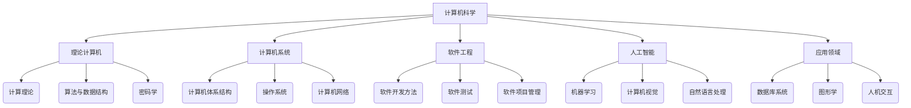
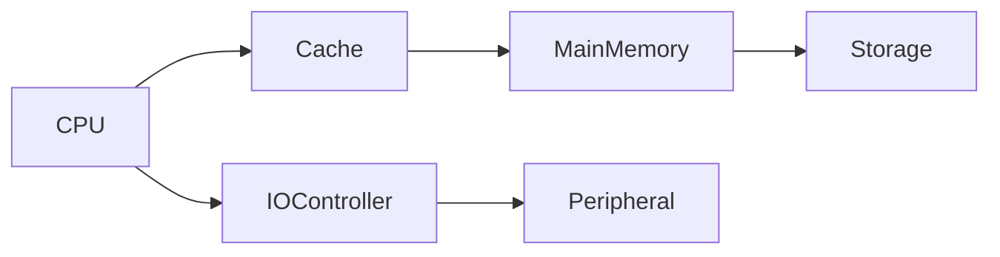
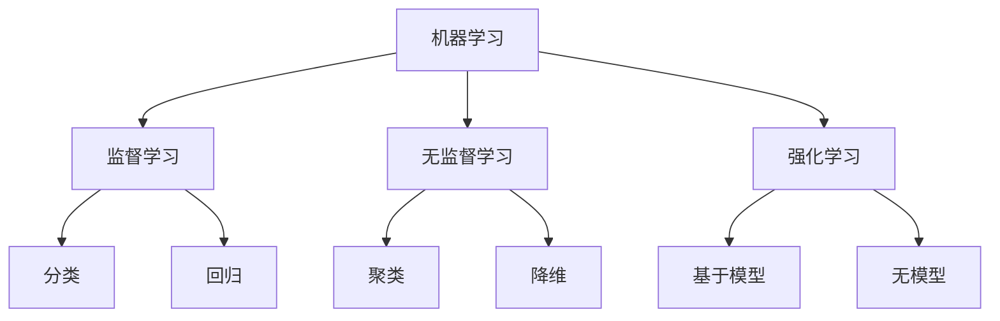
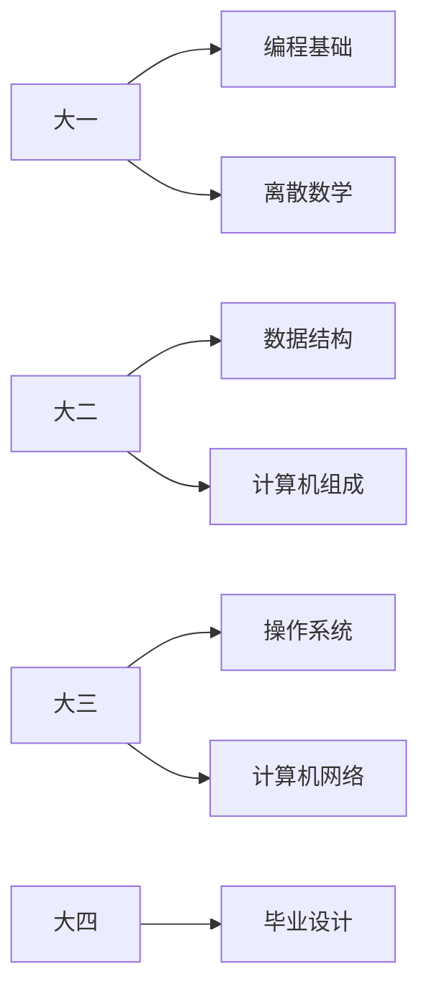

# 计算机科学全景解析

计算机科学是系统性研究计算理论、信息处理以及计算系统实现的学科。以下是计算机科学的体系化剖析：

## 1. 核心学科架构

### 计算机科学知识图谱



## 2. 理论计算机科学

### 计算理论体系
| 理论分支        | 核心问题                  | 典型成果               |
|----------------|--------------------------|-----------------------|
| 自动机理论     | 计算模型的形式化定义      | 有限状态机/下推自动机  |
| 可计算性理论   | 问题是否可解              | 停机问题/丘奇-图灵论题 |
| 计算复杂性理论 | 计算资源需求              | P/NP问题/复杂度类      |

### 形式语言层级
$$
\text{正则语言} \subset \text{上下文无关语言} \subset \text{上下文相关语言} \subset \text{递归可枚举语言}
$$

## 3. 算法与数据结构

### 算法复杂度分类
| 复杂度类      | 典型算法                | 应用场景             |
|--------------|------------------------|---------------------|
| O(1)         | 哈希查找                | 字典查询            |
| O(log n)     | 二分查找                | 有序集合查询        |
| O(n)         | 线性搜索                | 无序列表查找        |
| O(n log n)   | 快速排序                | 通用排序            |
| O(n²)        | 冒泡排序                | 小规模数据          |
| O(2^n)       | 旅行商问题穷举          | 组合优化            |

### 数据结构选型矩阵
| 需求          | 推荐结构                | 优势                  |
|--------------|------------------------|-----------------------|
| 快速插入/删除 | 哈希表                  | O(1)平均访问          |
| 有序数据      | 平衡二叉搜索树          | O(log n)操作          |
| 图形关系      | 邻接表/矩阵             | 高效遍历              |
| 层级关系      | B树/B+树               | 磁盘友好              |

## 4. 计算机系统

### 计算机体系结构



### 存储层次金字塔

$$
\begin{array}{c}
\text{速度} \\
\uparrow \\
\text{寄存器} \\
\text{高速缓存} \\
\text{主存储器} \\
\text{磁盘存储} \\
\text{磁带备份} \\
\downarrow \\
\text{容量}
\end{array}
$$

## 5. 软件开发方法

### 开发模型对比
| 模型          | 特点                      | 适用场景              |
|--------------|--------------------------|-----------------------|
| 瀑布模型      | 线性阶段                  | 需求明确项目          |
| 敏捷开发      | 迭代增量                  | 需求变化快           |
| 螺旋模型      | 风险驱动                  | 高风险系统            |
| DevOps       | 持续交付                  | 云原生应用            |

### 代码质量指标
| 指标          | 测量方法                | 健康阈值              |
|--------------|------------------------|-----------------------|
| 圈复杂度      | 控制流路径数            | <10                   |
| 代码重复率    | 克隆代码检测            | <5%                   |
| 测试覆盖率    | 执行代码比例            | >80%                  |
| 技术债务      | 静态分析问题            | 0关键问题             |

## 6. 人工智能领域

### 机器学习分类



### 深度学习架构
| 网络类型      | 典型结构                | 应用领域              |
|--------------|------------------------|-----------------------|
| CNN          | 卷积神经网络            | 图像识别              |
| RNN          | 循环神经网络            | 时序数据              |
| Transformer | 自注意力机制            | NLP任务               |
| GAN          | 生成对抗网络            | 图像生成              |

## 7. 应用领域技术

### 数据库系统演进
```
文件系统 → 层次数据库 → 关系数据库 → 
NoSQL → NewSQL → 多模数据库
```

### 图形学渲染管线
```
顶点数据 → 顶点着色 → 图元装配 → 
光栅化 → 片段着色 → 帧缓冲输出
```

## 8. 前沿研究方向

### 热点领域
| 领域          | 关键挑战                  | 突破方向              |
|--------------|--------------------------|-----------------------|
| 量子计算      | 量子纠错                  | 容错量子计算机        |
| 边缘计算      | 延迟优化                  | 分布式AI推理          |
| 隐私计算      | 数据安全                  | 同态加密              |
| 神经形态计算  | 能效比提升                | 类脑芯片设计          |

### 量子计算原理

$$
\text{量子比特} = \alpha|0\rangle + \beta|1\rangle \quad \text{其中} \ |\alpha|^2 + |\beta|^2 = 1
$$

## 9. 计算机教育体系

### 核心课程设置



### 能力培养模型

$$
\text{CS人才} = \alpha\cdot\text{编程能力} + \beta\cdot\text{数学基础} + \gamma\cdot\text{系统思维}
$$

## 10. 行业发展趋势

### 技术成熟度曲线

```
新兴技术 → 期望膨胀 → 泡沫低谷 → 
稳步爬升 → 生产成熟
```

### 2023年技术预测
| 技术          | 成熟度                  | 预计爆发期            |
|--------------|------------------------|-----------------------|
| AI生成内容    | 快速上升期              | 2023-2025             |
| Web3         | 泡沫调整期              | 2025-2028             |
| 数字孪生      | 稳步爬升期              | 2024-2026             |
| 6G通信       | 技术萌芽期              | 2030+                 |

计算机科学正在经历从经典计算到智能计算的范式转移，根据ACM最新报告：
- 全球CS专业人才缺口达4000万
- AI相关论文年增长率35%
- 量子计算投资年增长60%
- 开源项目贡献者超5000万

建议学习路径：
1. 夯实数学与算法基础
2. 掌握至少两门编程范式
3. 深入理解计算机系统
4. 选择垂直领域专精
5. 持续跟踪前沿进展