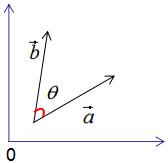
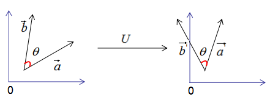
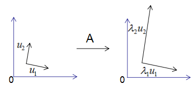

# 奇异值分解（SVD）

> 参考 <https://blog.csdn.net/qq_42722197/article/details/120858115>

> 奇异值分解（SVD）在降维，数据压缩，推荐系统等有广泛的应用，任何矩阵都可以进行奇异值分解，本文通过正交变换不改变基向量间的夹角循序渐进的推导SVD算法，以及用协方差含义去理解行降维和列降维，最后介绍了SVD的数据压缩原理 。

## 1.正交变换

正交变换公式：
$$
X=UY
$$

上式表示：X是Y的正交变换 ，其中U是正交矩阵，X和Y为列向量 。

下面用一个例子说明正交变换的含义：

假设有两个单位列向量a和b，两向量的夹角为θ，如下图：

现对向量a，b进行正交变换：

$$\vec{a'}=U*\vec{a}$$

$$\vec{b'}=U*\vec{b}$$

$\vec{a'}$$,$$\vec{b'}$的模：

$$\Vert\vec{a'}\Vert=\Vert U*\vec{a}\Vert=\Vert U \Vert*\Vert\vec{a}\Vert=\Vert\vec{a}\Vert=1$$

$$\Vert\vec{b'}\Vert=\Vert U*\vec{b}\Vert=\Vert U \Vert*\Vert\vec{b}\Vert=\Vert\vec{b}\Vert=1$$

由上式可知$\vec{a'}$和$\vec{b'}$的模都为1。

$\vec{a'}$和$\vec{b'}$的内积：

$$\vec{a'}^T*\vec{b'}=(U*\vec{a})^T*(U*\vec{b})=\vec{a}^TU^TU\vec{b}\Rightarrow\vec{a'}^T*\vec{b'}=\vec{a}^T*\vec{b} (1)$$

由上式可知，正交变换前后的内积相等。

$\vec{a'}$和$\vec{b'}$的夹角$\theta'$

$$\Large \cos\theta'=\frac{\vec{a'}^T*\vec{b'}}{\Vert\vec{a}\Vert*\Vert\vec{b'}\Vert} (2)$$

$$\Large \cos\theta=\frac{\vec{a'}^T*\vec{b}}{\Vert\vec{a}\Vert*\Vert\vec{b}\Vert} (3)$$

比较（2）式和（3）式得：正交变换前后的夹角相等，即：$\theta=\theta'$

因此，正交变换的性质可用下图来表示：

正交变换的两个重要性质：

1）正交变换不改变向量的模。

2）正交变换不改变向量的夹角。

如果向量$\vec{a}$和$\vec{b}$是基向量，那么正交变换的结果如下图：

上图可以得到重要结论：基向量正交变换后的结果仍是基向量 。基向量是表示向量最简洁的方法，向量在基向量的投影就是所在基向量的坐标，我们通过这种思想去理解特征值分解和推导SVD分解。

## 2.特征值分解的含义

对称方阵A的特征值分解为：

$$A=U\varSigma U^{-1} (2.1)$$

其中U是正交矩阵，$\varSigma$是对角矩阵。

为了可视化特征值分解，假设A是2×2的对称矩阵，$U=(\mu_1,\mu_2)$$，$$U=(\lambda_1,\lambda_2) （2.1）$式展开为：

$$A\mu_1=\lambda_1\mu_1$$

$$A\mu_2=\lambda_2\mu_2$$

用图形表示为：

由上图可知，矩阵A没有旋转特征向量，它只是对特征向量进行了拉伸或缩短（取决于特征值的大小），因此，对称矩阵对其特征向量（基向量）的变换仍然是基向量（单位化） 。

特征向量和特征值的几何意义：若向量经过矩阵变换后保持方向不变，只是进行长度上的伸缩，那么该向量是矩阵的特征向量，伸缩倍数是特征值。

## 3.SVD分解推导

我们考虑了当基向量是对称矩阵的特征向量时，矩阵变换后仍是基向量，但是，我们在实际项目中遇到的大都是行和列不相等的矩阵，如统计每个学生的科目乘积，行数为学生个数，列数为科目数，这种形成的矩阵很难是方阵，因此SVD分解是更普遍的矩阵分解方法 。

先回顾一下正交变换的思想：基向量正交变换后的结果仍是基向量 。

我们用正交变换的思想来推导SVD分解：

假设A是M*N的矩阵，秩为K，Rank(A)=k。

存在一组正交基V：

$$V=(v_1,v_2,\dots,v_k)$$

矩阵对其变换后仍是正交基，记为U：

$$U=(Av_1,Av_2,\dots,Av_k)$$

由正交基定义，得：

$$(Av_i)^T(av_j)=0$$ (3.1)

上式展开：

$$v_i^TA^TAv_j=0$$  (3.2)

当 $v_i$ 是 $A^T A$ 的特征值时，有

$$(A^TA)v_i=\lambda v_i$$

∵(3.2)式得：

$$\lambda v_i^Tv_j=0$$

即假设成立 。

图形表示如下：

正交向量的模：

$$||Av_i||^2 = (Av_i)^T*(Av_i) $$