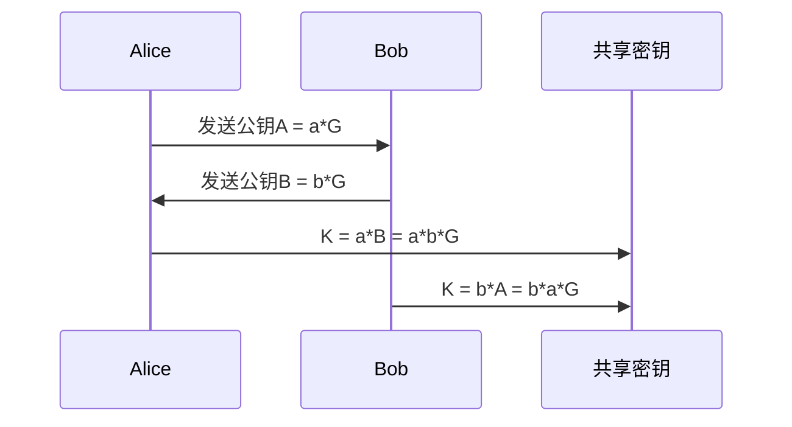
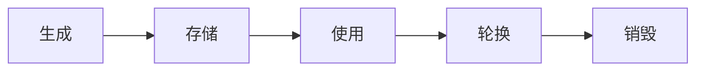

# 加密算法深度解析

加密算法是信息安全的核心基础，将从对称加密、非对称加密、哈希函数和密钥交换四个方面全面介绍现代加密技术。

## 一、对称加密算法

### 1. 高级加密标准(AES)
**原理**：基于代换-置换网络(SPN)结构
```python
def aes_encrypt(block, key):
    state = add_round_key(block, key[0])
    for round in range(1, 10):
        state = sub_bytes(state)       # S盒代换
        state = shift_rows(state)      # 行移位
        state = mix_columns(state)     # 列混淆
        state = add_round_key(state, key[round])
    state = sub_bytes(state)
    state = shift_rows(state)
    return add_round_key(state, key[10])
```
**关键参数**：
- 密钥长度：128/192/256位
- 轮数：10/12/14轮
- 数学基础：Galois域GF(2⁸)运算

### 2. ChaCha20流密码
**优势**：
- 抗侧信道攻击
- 移动设备性能优异
- IETF推荐替代RC4

**结构**：
```c
void chacha_block(uint32_t out[16], const uint32_t in[16]) {
    uint32_t x[16]; 
    memcpy(x, in, 64);
    // 20轮ARX运算
    for (int i = 0; i < 10; i++) {
        QUARTERROUND(x[0], x[4], x[8],  x[12]);
        QUARTERROUND(x[1], x[5], x[9],  x[13]);
        // ...其余3组
    }
    for (int i = 0; i < 16; ++i) out[i] = x[i] + in[i];
}
```

## 二、非对称加密算法

### 1. RSA算法
**密钥生成**：
1. 选择大素数p,q（通常2048位）
2. 计算n = p*q，φ(n) = (p-1)(q-1)
3. 选择e满足1 < e < φ(n)且gcd(e, φ(n)) = 1
4. 计算d ≡ e⁻¹ mod φ(n)

**数学运算**：
- 加密：$c = m^e \mod n$
- 解密：$m = c^d \mod n$
- 优化：使用中国剩余定理(CRT)加速

### 2. 椭圆曲线密码(ECC)
**曲线方程**：
$$ y^2 = x^3 + ax + b \mod p $$

**密钥交换(ECDH)** ：



**优势对比**：

| 安全级别 | RSA密钥长度 | ECC密钥长度 |
|----------|-------------|-------------|
| 112-bit  | 2048-bit    | 224-bit     |
| 128-bit  | 3072-bit    | 256-bit     |
| 256-bit  | 15360-bit   | 512-bit     |

## 三、哈希函数

### 1. SHA-3结构(Keccak)
**海绵结构**：
```
输入→[吸收阶段]→[挤压阶段]→输出
          ↓           ↑
        [置换函数f]
```

**参数配置**：
```python
{
    "bitrate": 1600 - 2*output_length,
    "capacity": 2*security_level,
    "permutation": Keccak-f[1600]
}
```

### 2. Argon2密码哈希
**抗ASIC设计**：
```c
void argon2(uint8_t *out, uint32_t outlen, 
           const uint8_t *pwd, uint32_t pwdlen,
           const uint8_t *salt, uint32_t saltlen) {
    // 内存填充
    fill_memory_blocks(pwd, salt);
    // 多次迭代
    for(uint32_t i=0; i<iterations; i++) {
        process_block_xor(prev_block, next_block);
    }
    // 最终哈希
    blake2b(out, outlen, memory[last_block]);
}
```

## 四、密钥交换协议

### 1. Diffie-Hellman协议
**数学原理**：
$$ \text{共享密钥} = g^{ab} \mod p $$

**前向安全性增强**：
```python
def ephemeral_dh():
    # 每次会话生成临时密钥对
    private_key = random_int(2, p-2)
    public_key = pow(g, private_key, p)
    return (private_key, public_key)
```

### 2. 量子安全方案
**CRYSTALS-Kyber**（NIST后量子标准）：
```python
def kyber_keygen():
    s = random_polynomial()  # 秘密多项式
    A = uniform_matrix()     # 公共矩阵
    t = A*s + e              # 误差项
    return (pk=(A,t), sk=s)
```

## 五、加密模式与填充

### 1. 认证加密(AEAD)
**AES-GCM工作流程**：
1. 初始化计数器CTR0
2. 计算GHASH认证标签
   $$ \text{GHASH} = \sum_{i=1}^n H^i \cdot C_i $$
3. 加密数据：
   $$ C_i = P_i \oplus E_K(CTR_i) $$

### 2. 填充方案对比
| 方案        | 安全性 | 适用场景 |
|-------------|--------|----------|
| PKCS#7      | 高     | 通用     |
| OAEP        | 极高   | RSA加密  |
| ZeroPadding | 低     | 特定协议 |

## 六、密码学前沿

### 1. 全同态加密(FHE)
**Bootstrapping操作**：
$$ \text{Decrypt}_{sk}(\text{Encrypt}_{pk}(\text{Decrypt}_{sk}(c))) $$

### 2. 零知识证明
**zk-SNARKs流程**：
1. 将问题转化为R1CS约束系统
2. 生成可信设置参数
3. 构造QAP多项式
4. 生成简洁证明

## 七、安全实践指南

### 1. 密钥生命周期管理



### 2. 算法推荐组合
| 场景         | 推荐方案                     |
|--------------|-----------------------------|
| 文件加密     | AES-256-GCM + Argon2        |
| 网络传输     | ChaCha20-Poly1305 + X25519  |
| 区块链       | secp256k1 + Keccak-256      |
| 后量子安全   | CRYSTALS-Kyber + Dilithium  |

## 八、性能优化技巧

### 1. AES硬件加速
```x86asm
; AES-NI指令示例
aesenc xmm0, xmm1   ; 单轮加密
aeskeygenassist xmm1, xmm2, 0x1 ; 轮密钥生成
```

### 2. ECC优化技术
- **蒙哥马利乘法**：减少模约简
- **滑动窗口法**：加速标量乘法
- **扭曲爱德华曲线**：统一加法公式

现代加密算法需要综合考虑安全性、性能和实现复杂度。建议在实际应用中：
1. 优先使用经过验证的标准算法
2. 保持密钥管理系统的独立性
3. 定期更新密码学组件
4. 进行第三方安全审计