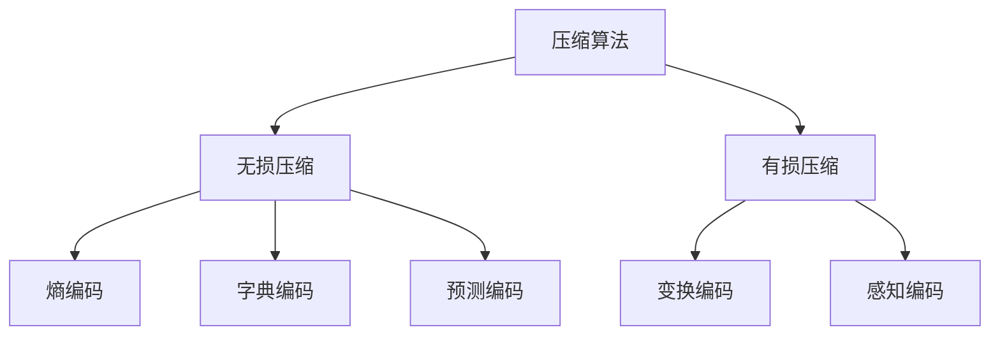

# 压缩算法全面解析

压缩算法是计算机科学中用于减少数据存储空间或传输带宽的核心技术，主要分为无损压缩和有损压缩两大类。以下是对压缩算法的系统梳理：

## 一、基础理论与分类

### 1. 信息论基础
- **熵(Entropy)** ：$H(X) = -\sum p(x)\log p(x)$，表示信息的最小平均编码长度
- **压缩极限**：根据香农源编码定理，无损压缩率不能低于信息的熵

### 2. 算法分类


## 二、无损压缩算法

### 1. 熵编码（统计编码）

#### (1) 霍夫曼编码
- **原理**：为高频符号分配短码字，低频符号分配长码字
- **实现步骤**：
  1. 统计符号频率
  2. 构建霍夫曼树
  3. 生成前缀码表

```python
import heapq

def build_huffman_tree(freq):
    heap = [[weight, [symbol, ""]] for symbol, weight in freq.items()]
    heapq.heapify(heap)
    while len(heap) > 1:
        lo = heapq.heappop(heap)
        hi = heapq.heappop(heap)
        for pair in lo[1:]:
            pair[1] = '0' + pair[1]
        for pair in hi[1:]:
            pair[1] = '1' + pair[1]
        heapq.heappush(heap, [lo[0] + hi[0]] + lo[1:] + hi[1:])
    return heap[0][1:]
```

#### (2) 算术编码
- **特点**：将整个消息编码为一个[0,1)区间的小数
- **优势**：接近熵极限，适合小符号集数据
- **公式**：
  
  $$ \text{区间} = \text{low} + (\text{high} - \text{low}) \times \text{cum_prob}[symbol] $$

### 2. 字典编码

#### (1) LZ77算法
- **核心概念**：
  - 滑动窗口(32KB典型值)
  - 前向缓冲区
- **输出格式**：`<偏移量，长度，下一个字符>`

#### (2) LZW算法
```python
def lzw_compress(data):
    dictionary = {chr(i): i for i in range(256)}
    next_code = 256
    result = []
    w = ""
    
    for c in data:
        wc = w + c
        if wc in dictionary:
            w = wc
        else:
            result.append(dictionary[w])
            dictionary[wc] = next_code
            next_code += 1
            w = c
    if w:
        result.append(dictionary[w])
    return result
```

### 3. 预测编码
- **PNG滤波**：使用前一个像素预测当前像素
  - 滤波器类型：None, Sub, Up, Average, Paeth
- **Delta编码**：存储差值而非绝对值

## 三、有损压缩算法

### 1. 变换编码

#### (1) JPEG的DCT变换
- **流程**：
  1. 颜色空间转换(RGB→YCbCr)
  2. 8×8分块
  3. DCT变换：$F(u,v) = \frac{1}{4}C(u)C(v)\sum_{x=0}^7\sum_{y=0}^7 f(x,y)\cos\frac{(2x+1)u\pi}{16}\cos\frac{(2y+1)v\pi}{16}$
  4. 量化
  5. 熵编码

#### (2) 小波变换(JPEG2000)
- 使用Daubechies等小波基函数
- 优势：更好的能量集中特性

### 2. 感知编码

#### (1) MP3音频压缩
- 关键技术：
  - 心理声学模型
  - 掩蔽效应利用
  - 哈夫曼编码

#### (2) H.264视频压缩
- 帧间预测：运动估计与补偿
- 帧内预测：9种预测模式
- CABAC熵编码

## 四、现代压缩算法

### 1. Brotli算法
- Google开发，结合LZ77+霍夫曼编码
- 特点：
  - 预定义静态字典(常见web词汇)
  - 上下文建模
- 压缩率比gzip高20-26%

### 2. Zstandard(Zstd)
```c
// 典型压缩调用
ZSTD_compress(output, outSize, input, inSize, compressionLevel);
```
- 特性：
  - 字典支持(可训练)
  - 并行处理
  - 压缩速度比zlib快5-10倍

### 3. Neural Compression
- 基于深度学习的压缩：
  - 自编码器架构
  - 变分自编码器(VAE)
  - GAN-based压缩
- 典型模型：
  - HiFiC(图像)
  - WaveNet(音频)

## 五、算法比较与选型

| 算法 | 压缩率 | 速度 | 内存 | 典型应用 |
|------|--------|------|------|----------|
| DEFLATE | 中 | 中 | 低 | ZIP, PNG |
| LZMA | 高 | 慢 | 高 | 7-Zip |
| Zstd | 中高 | 快 | 中 | 实时系统 |
| Brotli | 高 | 中 | 中 | Web传输 |
| JPEG | - | 快 | 低 | 图像 |
| MPEG-4 | - | 慢 | 高 | 视频 |

## 六、专业优化技术

### 1. 熵编码优化
- **Range Coding**：比算术编码更高效的实现
- **ANS(Asymmetric Numeral Systems)** ：
  - 新式熵编码
  - 用于Zstandard
  - 比霍夫曼编码快30%

### 2. 并行压缩
- **块级并行**：将数据分块独立压缩
- **流水线设计**：同时执行查找、匹配、编码阶段

### 3. 硬件加速
- Intel QAT：专用压缩加速器
- GPU加速：CUDA实现LZSS等算法
- FPGA实现：定制压缩流水线

## 七、压缩标准演进

1. **早期**：Huffman(1952), LZ77(1977)
2. **工业标准**：DEFLATE(1996), JPEG(1992)
3. **现代标准**：HEVC(2013), AV1(2018)
4. **前沿方向**：神经压缩(2020+)

## 八、实际应用建议

### 1. 文本数据
- **首选**：Zstd/Brotli(高压缩率)
- **备选**：gzip(兼容性好)

### 2. 图像数据
- **无损**：PNG(医疗影像)
- **有损**：WebP(网页), AVIF(新一代)

### 3. 时间序列数据
- **Delta+RLE**：传感器数据
- **Gorilla**：Facebook时间序列专用

理解各类压缩算法的原理和特性，能够帮助在实际工程中选择最适合的压缩方案，平衡压缩率、速度和资源消耗之间的关系。