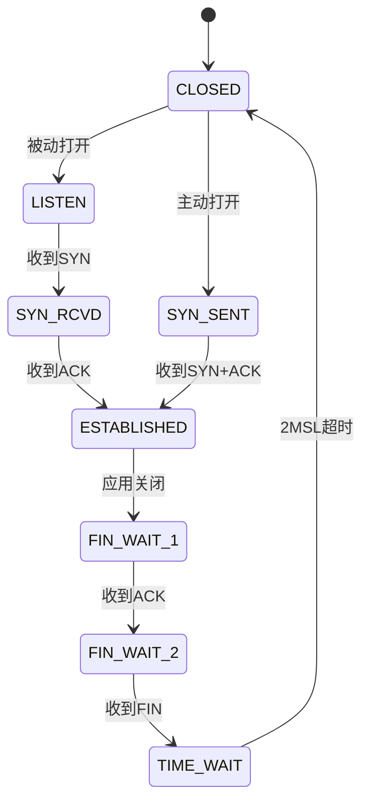

# OSI七层参考模型深度解析

## 模型概述与历史背景

OSI（Open Systems Interconnection）参考模型是国际标准化组织（ISO）在1984年发布的ISO/IEC 7498标准中提出的网络体系结构框架。该模型将计算机网络通信划分为七个层次，每个层次都建立在下一层的基础上，并为上一层提供服务。

### 模型发展历程
```
1978年 → ISO成立SC16委员会
1980年 → 首次提出分层架构草案
1983年 → 形成DIS 7498标准
1984年 → 正式发布为国际标准
1994年 → 发布修订版ISO/IEC 7498-1
```

## 七层结构详解

### 1. 物理层（Physical Layer）

**核心职责**：
- 定义物理介质特性（机械/电气/功能/规程）
- 比特流传输与同步
- 拓扑结构实现

**关键技术指标**：
$$
\begin{aligned}
&\text{带宽容量}： C = B \log_2(1 + SNR) \\
&\text{传播时延}： t_p = \frac{d}{v} \quad (d:\text{距离}, v:\text{传播速度})
\end{aligned}
$$

**典型标准对比**：

| 标准      | 介质类型   | 最大速率 | 最大距离 |
|-----------|------------|----------|----------|
| 10BASE-T  | 双绞线     | 10 Mbps  | 100 m    |
| 100BASE-FX| 多模光纤   | 100 Mbps | 2 km     |
| 1000BASE-T| 双绞线     | 1 Gbps   | 100 m    |

### 2. 数据链路层（Data Link Layer）

**功能架构**：
```
┌───────────────────────┐
│  逻辑链路控制(LLC)    │ ← 802.2标准
├───────────────────────┤
│ 介质访问控制(MAC)     │ ← 以太网/802.3等
└───────────────────────┘
```

**关键机制**：
- **帧结构**（以太网为例）：
  ```
  ┌─────┬─────┬─────┬─────┬─────┬─────┐
  │前导码│ 目的地址 │ 源地址 │类型 │ 数据 │ FCS │
  │7字节│ 6字节   │ 6字节 │2字节│46-1500字节│4字节│
  └─────┴─────┴─────┴─────┴─────┴─────┘
  ```
  
- **CSMA/CD算法流程**：
  ```python
  while 要发送数据:
      if 信道空闲:
          发送并监听
          if 检测到冲突:
              发送干扰信号
              等待随机时间(二进制指数退避)
      else:
          持续监听直到信道空闲
  ```

### 3. 网络层（Network Layer）

**路由算法对比分析**：

| 特性          | 距离向量(RIP)       | 链路状态(OSPF)      | 路径向量(BGP)       |
|---------------|---------------------|---------------------|---------------------|
| 收敛速度      | 慢(分钟级)          | 快(秒级)            | 极慢(小时级)        |
| 带宽消耗      | 定期发送整个路由表  | 只发送变化部分      | 增量更新            |
| 适用规模      | <15跳               | 大中型网络          | 自治系统间          |
| 环路防止      | 毒性逆转/水平分割   | SPF算法保证无环     | AS_PATH属性         |

**IP分片重组算法**：
$$
\text{分片偏移量} = \frac{\text{原始分组长度} - 20}{8} \times \text{分片序号}
$$

### 4. 传输层（Transport Layer）

**TCP协议状态机**：



**拥塞控制算法演进**：
1. Tahoe（1988）：慢启动+拥塞避免
2. Reno（1990）：增加快速重传
3. NewReno（1996）：改进部分ACK处理
4. CUBIC（2005）：三次函数窗口增长

### 5-7. 高层协议栈

**协议栈映射关系**：

| OSI层   | 典型协议簇                | 安全增强协议          |
|---------|---------------------------|-----------------------|
| 应用层  | HTTP/FTP/SMTP/DNS         | HTTPS/SFTP/DNSSEC     |
| 表示层  | SSL/TLS/JPEG/MPEG         | TLS 1.3/加密压缩      |
| 会话层  | NetBIOS/RPC/SSH会话       | Kerberos认证          |

## 现代网络中的OSI模型实践

### 云计算环境适配

```
┌───────────────────────────────────────┐
│           虚拟化覆盖网络              │ ← VXLAN/NVGRE (L2 over L3)
├───────────────────────────────────────┤
│           物理底层网络                │ ← 传统OSI分层
└───────────────────────────────────────┘
```

### 物联网协议栈调整

```
┌───────────────────────────────────────┐
│           应用层(CoAP/MQTT)           │
├───────────────────────────────────────┤
│           适配层(6LoWPAN)             │ ← 头部压缩/分片
├───────────────────────────────────────┤
│           物理层(IEEE 802.15.4)       │
└───────────────────────────────────────┘
```

## 性能优化方法论

### 分层优化策略

1. **物理层优化**：
   - 信道编码改进：LDPC码编码增益：
     $$
     G_{coding} = 10 \log_{10}(\frac{R_c}{1 - H(p)})
     $$
     其中$R_c$为码率，$H(p)$为信道熵

2. **传输层优化**：
   - TCP加速技术：
     - 窗口缩放因子计算：
       $$
       W_{max} = 2^{S} \times MSS \quad (S:\text{缩放因子})
       $$
     - 选择性确认(SACK)优化重传

### 协议开销分析

各层头部开销占比（以太网/IPv4/TCP/HTTP为例）：

```
┌───────────────┬───────────────┐
│   协议层      │  头部大小     │
├───────────────┼───────────────┤
│  以太网       │    18字节     │
├───────────────┼───────────────┤
│  IPv4         │    20字节     │
├───────────────┼───────────────┤
│  TCP          │    20字节     │
├───────────────┼───────────────┤
│  HTTP         │   ~50字节     │
└───────────────┴───────────────┘
总开销比例 = (18+20+20+50)/(18+20+20+50+数据载荷)
```

该模型为网络架构设计提供了系统化的方法论指导，尽管实际协议栈（如TCP/IP）可能合并某些层次，但OSI的分层思想仍是网络工程的基础框架。