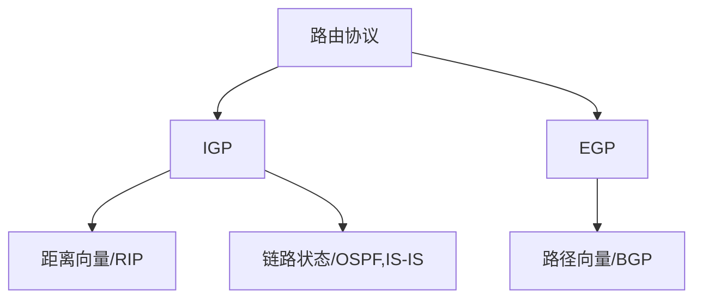

# TCP/IP协议体系深度解析

## 模型概述与历史演进

TCP/IP模型是互联网实际采用的协议体系，由美国国防部ARPANET项目发展而来，与OSI模型相比更加简洁实用。其发展历程如下：

```
1969年 → ARPANET诞生
1973年 → TCP协议雏形
1978年 → TCP/IPv4正式规范
1983年 → ARPANET全面切换至TCP/IP
1999年 → IPv6标准发布(RFC 2460)
```

## 四层结构详解

### 1. 网络接口层（Network Interface Layer）

**功能融合**：
- 合并OSI物理层和数据链路层功能
- 实现"最后一公里"通信

**技术标准矩阵**：

| 类型       | 典型标准                 | 寻址方式      | 最大传输单元(MTU) |
|------------|--------------------------|---------------|-------------------|
| 有线以太网 | IEEE 802.3 (1000BASE-T)  | MAC地址       | 1500字节         |
| 无线网络   | IEEE 802.11ac            | MAC地址       | 2304字节         |
| 广域网     | PPP/HDLC                 | 无硬件地址    | 1500-4470字节    |
| 蜂窝网络   | LTE/5G NR                | IMSI+临时标识 | 1500-9000字节    |

**MTU发现算法**：
$$
\text{路径MTU} = \min(\text{所有链路MTU})
$$
通过ICMP分片需要报文动态探测

### 2. 网际层（Internet Layer）

**核心协议对比**：

| 特性          | IPv4                   | IPv6                     |
|---------------|------------------------|--------------------------|
| 地址长度      | 32位 (4字节)           | 128位 (16字节)           |
| 头部大小      | 20-60字节              | 固定40字节               |
| 分片处理      | 路由器可分片           | 只在源端分片             |
| QoS支持       | ToS字段(8位)           | 流标签字段(20位)          |
| 安全性        | 依赖上层               | 内置IPsec支持            |

**路由协议分类**：



**NAT转换原理**：
$$
\text{公网IP}: \text{端口} \leftrightarrow \text{私网IP}: \text{端口}
$$
转换表维护示例：
```
┌──────────────┬──────────────┬──────────────┐
│ 内部地址     │ 外部地址     │ 过期时间     │
├──────────────┼──────────────┼──────────────┤
│ 192.168.1.2:3456 │ 203.0.113.1:54321 │ 2023-12-31T23:59:59 │
└──────────────┴──────────────┴──────────────┘
```

### 3. 传输层（Transport Layer）

**协议选择决策树**：
```python
def select_transport_protocol(requirements):
    if requirements['reliability']:
        if requirements['latency_sensitive']:
            return "QUIC"
        else:
            return "TCP"
    else:
        if requirements['multicast']:
            return "UDP Multicast"
        else:
            return "UDP"
```

**TCP关键机制**：
1. **序列号空间**：
   $$
   \text{序列号} = (\text{初始序列号} + \text{字节计数}) \mod 2^{32}
   $$
2. **滑动窗口动态调整**：
   $$
   W(t) = \begin{cases}
   W(t-1) + MSS & \text{慢启动阶段} \\
   W(t-1) + \frac{MSS^2}{W(t-1)} & \text{拥塞避免阶段}
   \end{cases}
   $$

**UDP特性矩阵**：

| 应用场景       | 典型协议/应用          | 端口范围       |
|----------------|------------------------|----------------|
| 实时音视频     | RTP/WebRTC            | 16384-32767   |
| 域名解析       | DNS                    | 53             |
| 网络管理       | SNMP                   | 161            |
| 组播应用       | IGMP                   | 224.0.0.0-239.255.255.255 |

### 4. 应用层（Application Layer）

**协议栈安全演进**：

```
┌───────────────────────┐
│ HTTP/3 (基于QUIC)     │ ← TLS 1.3
├───────────────────────┤
│ HTTP/2                │ ← TLS 1.2
├───────────────────────┤
│ HTTPS (HTTP over TLS) │ ← TLS 1.0-1.2
├───────────────────────┤
│ 明文HTTP              │ ← 已淘汰
└───────────────────────┘
```

**DNS解析过程**：
1. 递归查询路径：
   ```
   用户 → 本地DNS → 根DNS → 顶级域DNS → 权威DNS
   ```
2. RR记录类型：
   ```
   ┌────────────┬───────────────┬──────────────┐
   │ 类型       │ 用途          │ 示例         │
   ├────────────┼───────────────┼──────────────┤
   │ A          │ IPv4地址      │ 192.0.2.1   │
   │ AAAA       │ IPv6地址      │ 2001:db8::1 │
   │ MX         │ 邮件交换      │ 10 mail.example.com │
   │ CNAME      │ 规范名称      │ www → example.com │
   └────────────┴───────────────┴──────────────┘
   ```

## 与OSI模型的映射关系

**功能对应表**：

| TCP/IP层        | OSI对应层          | 核心差异                  |
|-----------------|--------------------|--------------------------|
| 应用层          | 应用层+表示层+会话层 | 合并高层功能             |
| 传输层          | 传输层             | 几乎完全对应             |
| 网际层          | 网络层             | 增加ICMP/IGMP等辅助协议  |
| 网络接口层      | 数据链路层+物理层  | 不定义具体实现标准       |

**协议栈对比**：

```
OSI模型：
┌───────┐ ┌───────┐ ┌───────┐ ┌───────┐ ┌───────┐ ┌───────┐ ┌───────┐
│   7   │ │   6   │ │   5   │ │   4   │ │   3   │ │   2   │ │   1   │
└───────┘ └───────┘ └───────┘ └───────┘ └───────┘ └───────┘ └───────┘

TCP/IP模型：
┌───────────────────────────────────────┐
│            应用层                     │
├───────────────────────────────────────┤
│            传输层                     │
├───────────────────────────────────────┤
│            网际层                     │
├───────────────────────────────────────┤
│            网络接口层                 │
└───────────────────────────────────────┘
```

## 现代网络中的TCP/IP创新

### 5G网络增强

1. **协议栈优化**：
   - 用户面：采用UDP-based的快速传输
   - 控制面：HTTP/2 over QUIC

2. **网络切片技术**：
   ```
   ┌───────────────────────────────────────┐
   │ 切片A：eMBB (增强移动宽带)           │ ← TCP优化版
   ├───────────────────────────────────────┤
   │ 切片B：URLLC (超可靠低延迟通信)      │ ← 定制UDP协议
   ├───────────────────────────────────────┤
   │ 切片C：mMTC (大规模物联网)           │ ← CoAP/6LoWPAN
   └───────────────────────────────────────┘
   ```

### 云计算网络架构

**云原生协议栈**：
```
┌───────────────────────────────────────┐
│           服务网格(Service Mesh)       │ ← Istio/Linkerd
├───────────────────────────────────────┤
│           HTTP/gRPC代理层             │
├───────────────────────────────────────┤
│            overlay网络(VXLAN)          │
├───────────────────────────────────────┤
│           物理网络(TCP/IP)             │
└───────────────────────────────────────┘
```

## 性能调优实践

### 关键参数优化

1. **TCP窗口缩放**：
   - 计算理论最优窗口：
     $$
     W_{opt} = \text{RTT} \times \text{带宽}
     $$
   - Linux系统设置：
     ```bash
     sysctl -w net.ipv4.tcp_window_scaling=1
     sysctl -w net.ipv4.tcp_rmem='4096 87380 6291456'
     ```

2. **UDP缓冲区调整**：
   ```bash
   sysctl -w net.core.rmem_max=16777216
   sysctl -w net.core.wmem_max=16777216
   ```

### 协议选择决策矩阵

| 应用特征          | 推荐协议          | 配置建议                  |
|-------------------|-------------------|--------------------------|
| 高可靠性要求      | TCP+QUIC         | 开启SACK/Fast Open       |
| 低延迟需求        | UDP+前向纠错     | 调整缓冲区大小           |
| 多播/广播场景     | UDP组播          | 设置TTL和组播地址        |
| 移动网络环境      | QUIC             | 启用0-RTT和连接迁移      |

该模型作为互联网的基础协议架构，其设计哲学体现了"端到端原则"和"尽力而为"的服务理念，为全球网络互联提供了根本保障。